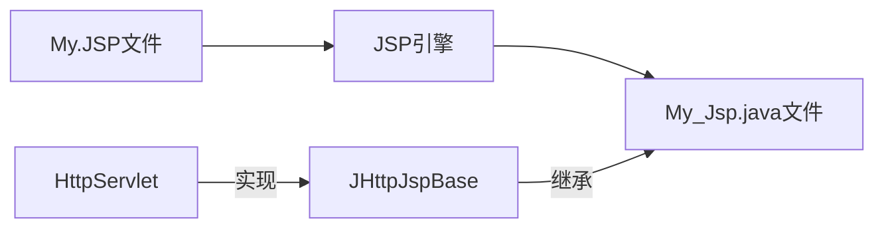

# 1 JSP 概念

> 应用场景： 服务页面展示
>
> JSP（Java Server Pages）,，是一种简化版的 servlet ，是一种动态网页技术标准。

## 1.1 特点

> 本质上是 servlet
>
> 跨平台，组件跨平台
>
> 健壮性和安全性


# 2 JSP 原理

> JSP 中可以书写 java 代码，但是 java 代码会被原样转译到对应的 java 文件（也就是 servlet 文件）
>
> 然后执行转译好的 serlvet。
>
> 注意： 在 Tomcat 的 work 目录里面存放 JSP 转译成 Servlet 的文件




# 3 JSP 指令

> 基本格式 :`<% Java 代码;  %>`

## 3.1 page 指令

> 设置 JSP 转译时一些的配置信息
>
> 基本格式  `<%@page key=value,key2=value2%>`

### 1  基本语法

```jsp
<%@page language="java"%><!-- 声明转译语言 -->
<%@page import="java.util.*",import="java.lang.*"%><!-- 声明导入的包,多个包用逗号隔开-->
<%@page pageEncoding="utf-8"%><!-- 设置 Jsp 的数据保存的编码格式 -->
<%@page contentType="text/html;charset=utf-8"%> <!-- 设置数据的响应编码格式 -->
<%@page session="false"%><!-- 设置session为false，默认打开 session -->
<%@page isErrorPage="true"%><!--默认为false true 表示开启 exception 异常对象的使用-->
<%@page errorPage="error.jsp"%><!-- 当 jsp运行出现异常错误时跳转-->
 
```

## 3.2 局部代码块

> 格式：`<%  Java 代码  %>`
>
> 特点：局部代码块的 java 代码，在被转移时,会被方法 `_jspService `执行

```jsp
<%--局部代码块 --%>
<% 
   			int a =1;
   			out.print("我是局部代码块"+a+"<br/>");
   			out.println("我是想调用一哈 Test()方法:<br/>");
   			out.println(Test()); //调用 Test()方法
%>
```


## 3.2 全局代码块

> 格式：`<%! 声明全局java 代码 %>`
>
> 特点：全局代码块中声明的java 代码，在被转译时，会在 servlet 所在的类声明变量或者方法

```jsp
<%-- 全局代码块 --%>
<%!
   	int b =1;
   	public String Test(){
   		return "<br/>我是Test()方法，我被调用了...";
   	}
%>
```


## 3.3 脚本段(表达式)

> 格式：`<%=变量名或者方法名()%>`
>
> 注意：不用分号结尾
>
> 作用：将 java 代码的元素结果数据或者其他数据响应给浏览器


```jsp
<%--表达式 或叫脚本 --%>
 <br/>
  <font color="red" size="200px">b=<%=b %></font>
```


## 3.4 JSP 注释

> 格式： `<%--  要注释的内容 --%>`
>
> HTML注释： 会被转义也会被响应给浏览器，但是浏览器不执行
>
> CSS 注释:    会被转义也会被响应给浏览器，但是浏览器不执行
>
> Js 注释：  会被转义也会被响应给浏览器，但是浏览器不执行
>
> Java 注释： 会被转义也会被响应给浏览器，但是浏览器不执行
>
> JSP注释： **不会被转义但是不会响应给浏览器**

```jsp

<!-- HTML 注释 -->  
<%-- JSP注释 --%>
&copy；网站声明
```

## 3.5 include 指令

> 应用场景：相同的资源在不同Jsp页面中使用,减少了代码的重复书写及维护难度
>
> 作用：实现了不同jsp之间的资源共享,适用于少量资源的引入

### 1  静态引入

> 格式:`<%@include file="要引入的资源的相对路径"%>`
>
> 特点： 被引入的jsp 文件和原有jsp 文件被转译成一个 java 文件
>
> 注意：静态引入的相关jsp文件不能声明同名变量

```jsp
<!-- TestIncludeStatic.jsp 部分关键代码-->	
<%--静态引入 --%>
 <%@include file="pagebycall.jsp" %>

```

```jsp
<!-- pagebycall.jsp 部分代码-->
<i>&copy;版权所有，电话：81233122</i>
```


### 2 动态引入

> 格式: `<jsp:include page="要引入的资源的相对路径"></jsp:include>`
>
> 特点：被引入的 jsp 文件会被单独转译
>
> 注意：动态引入的相关 jsp 文件中可以声明同名变量

```jsp
<%--动态引入 jsp 页面资源 --%>
<jsp:include page="pagebycall.jsp"></jsp:include>
```

```jsp
<!-- pagebycall.jsp 部分代码-->

```

## 3.6 forward 指令

> 应用场景：不同的jsp在处理请求时，有可能会将当前的请求转发另外的jsp处理
>
> 格式：
>
> `<jsp:forward page="要转发的jsp的相对路径">`
>
> ​	`<jsp:param value="" name=""></jsp:param>`
>
> `</jsp:forward>` 
>
> 
>
> 注意：除了`<jsp:forward>`子标签，其他的都不能加上，否则会报错。
>
> 作用：页面转发

- 页面转发的 jsp 文件

```jsp
<%@ page language="java" import="java.util.*"   pageEncoding="utf-8" contentType="text/html;charset=utf-8"%>
<!DOCTYPE html>
<html>
  <head>
    <title>forward 指令</title>
  </head>
  <body>
	<h1>forward 页面转发</h1>	
	<%
		int a=5;
		if(a%2==0){	
	%>
		<b>是偶数，鉴定完毕</b>
	<%}else{%>
	 	<%--页面转发 --%>
		<jsp:forward page="byforward.jsp">
			<jsp:param name="uname" value="zangsi"></jsp:param>
		</jsp:forward>
	<%}%>
	
  </body>
</html>

```

- 页面转发过去 Jsp 文件

```jsp
<%@ page language="java" import="java.util.*"  pageEncoding="utf-8" contentType="text/html; charset=utf-8"%>
<html>
  <head>
    <title>处理</title>
  </head>
  <body>
  		<%
  			String name = request.getParameter("uname");
  		%>
  		<%=name %>
    	<b>&nbsp;你有点背，你的服务已经到期，请续费</b>
  </body>
</html>

```


# 4 JSP 内置对象

> jsp在jsp在转义成器对应的java文件（也就是servlet）时
>
> 会默认在_jspService 方法中声明创建几个对象
>
> 特点：在jsp页面中声明的java **局部代码块**，在代码中直接使用内置对象
>
> 对象: request,session,application,out.response,config,exception,pageContext 
>
> 注意：对象的名字**必须是转义好的java文件中声明的对象名**

pagecontext： 页面上下文对象，此对象封存了封存了八个对象。

注意：一个 jsp 页面一个pageContext 对象。pageContext 对象每次请求都会重新创建

作用域：当前 jsp 页面 

request: 封存了请求相关数据，由服务器创建

session：解决了同一个用户不同请求的数据共享

application：ServletContext对象，解决不同用户之间数据共享

out：响应数据的对象，较于response对象，out对象底层使用的缓冲区，out对象的效率高于response

response：响应对象，设置编码格式

page：代表当前被执行的jsp转译的 java文件的对象

config：ServletConfig 对象，使用此对象完成资源的初始化

exception：jsp 页面的异常对象，封存了异常信息


举例：转译好的 servlet 

```java
/*
 * Generated by the Jasper component of Apache Tomcat
 * Version: Apache Tomcat/7.0.69
 * Generated at: 2019-03-07 09:48:49 UTC
 * Note: The last modified time of this file was set to
 *       the last modified time of the source file after
 *       generation to assist with modification tracking.
 */
package org.apache.jsp;

import javax.servlet.*;
import javax.servlet.http.*;
import javax.servlet.jsp.*;
import java.util.*;

public final class index_jsp extends org.apache.jasper.runtime.HttpJspBase
    implements org.apache.jasper.runtime.JspSourceDependent {

  private static final javax.servlet.jsp.JspFactory _jspxFactory =
          javax.servlet.jsp.JspFactory.getDefaultFactory();

  private static java.util.Map<java.lang.String,java.lang.Long> _jspx_dependants;

  private volatile javax.el.ExpressionFactory _el_expressionfactory;
  private volatile org.apache.tomcat.InstanceManager _jsp_instancemanager;

  public java.util.Map<java.lang.String,java.lang.Long> getDependants() {
    return _jspx_dependants;
  }

  public javax.el.ExpressionFactory _jsp_getExpressionFactory() {
    if (_el_expressionfactory == null) {
      synchronized (this) {
        if (_el_expressionfactory == null) {
          _el_expressionfactory = _jspxFactory.getJspApplicationContext(getServletConfig().getServletContext()).getExpressionFactory();
        }
      }
    }
    return _el_expressionfactory;
  }

  public org.apache.tomcat.InstanceManager _jsp_getInstanceManager() {
    if (_jsp_instancemanager == null) {
      synchronized (this) {
        if (_jsp_instancemanager == null) {
          _jsp_instancemanager = org.apache.jasper.runtime.InstanceManagerFactory.getInstanceManager(getServletConfig());
        }
      }
    }
    return _jsp_instancemanager;
  }

  public void _jspInit() {
  }

  public void _jspDestroy() {
  }

  public void _jspService(final javax.servlet.http.HttpServletRequest request, final javax.servlet.http.HttpServletResponse response)
        throws java.io.IOException, javax.servlet.ServletException {

    final javax.servlet.jsp.PageContext pageContext;
    javax.servlet.http.HttpSession session = null;
    final javax.servlet.ServletContext application;
    final javax.servlet.ServletConfig config;
    javax.servlet.jsp.JspWriter out = null;
    final java.lang.Object page = this;
    javax.servlet.jsp.JspWriter _jspx_out = null;
    javax.servlet.jsp.PageContext _jspx_page_context = null;


    try {
      response.setContentType("text/html;charset=UTF-8");
      pageContext = _jspxFactory.getPageContext(this, request, response,
      			null, true, 8192, true);
      _jspx_page_context = pageContext;
      application = pageContext.getServletContext();
      config = pageContext.getServletConfig();
      session = pageContext.getSession();
      out = pageContext.getOut();
      _jspx_out = out;

      out.write('\r');
      out.write('\n');

String path = request.getContextPath();
String basePath = request.getScheme()+"://"+request.getServerName()+":"+request.getServerPort()+path+"/";

      out.write("\r\n");
      out.write("\r\n");
      out.write("<!DOCTYPE HTML PUBLIC \"-//W3C//DTD HTML 4.01 Transitional//EN\">\r\n");
      out.write("<html>\r\n");
      out.write("  <head>\r\n");
      out.write("    <base href=\"");
      out.print(basePath);
      out.write("\">\r\n");
      out.write("    \r\n");
      out.write("    <title>My JSP 'index.jsp' starting page</title>\r\n");
      out.write("\t<meta http-equiv=\"pragma\" content=\"no-cache\">\r\n");
      out.write("\t<meta http-equiv=\"cache-control\" content=\"no-cache\">\r\n");
      out.write("\t<meta http-equiv=\"expires\" content=\"0\">    \r\n");
      out.write("\t<meta http-equiv=\"keywords\" content=\"keyword1,keyword2,keyword3\">\r\n");
      out.write("\t<meta http-equiv=\"description\" content=\"This is my page\">\r\n");
      out.write("\t\r\n");
      out.write("  </head>\r\n");
      out.write("  \r\n");
      out.write("  <body>\r\n");
      out.write("   \t\t<h1> 欢迎  </h1>\r\n");
      out.write("   \t\t<b>");
 
   				out.print(session.getAttribute("uname")); 
   			
      out.write("\r\n");
      out.write("   \t\t</b>\r\n");
      out.write("   \t\t登录成功！\r\n");
      out.write("  </body>\r\n");
      out.write("</html>\r\n");
    } catch (java.lang.Throwable t) {
      if (!(t instanceof javax.servlet.jsp.SkipPageException)){
        out = _jspx_out;
        if (out != null && out.getBufferSize() != 0)
          try {
            if (response.isCommitted()) {
              out.flush();
            } else {
              out.clearBuffer();
            }
          } catch (java.io.IOException e) {}
        if (_jspx_page_context != null) _jspx_page_context.handlePageException(t);
        else throw new ServletException(t);
      }
    } finally {
      _jspxFactory.releasePageContext(_jspx_page_context);
    }
  }
}

```


# 5 JSP和Servlet 的职责

> JSP 负责页面展示
>
> Servlet 负责业务逻辑

 请求转发可以使用：request 对象可以使用和 session 对象作数据流转

重定向可以使用： session 对象为数据流转


# 6 相对路径和绝对路径

> Servlet 重定向 resp.sendRedirect("jsp 页面或者 servlet 的别名")
>
> Servlet 请求转发 req.getRequestDispatcher("jsp相对路径/servlet 的别名")
>
> webapps 服务器根目录
>
> webapps\project\ 项目根目录

6.1 相对路径

> 从当前请求路径查找 jsp 所经过的路径

```
resp.sendRedirect("user/main.jsp");
```

## 6.2 绝对路径

> 从项目根目录开始查找 jsp 
>
> 建议写 绝对路径
>
> 重定向格式：/虚拟项目名/资源目录/*.jsp
>
> 请求转发格式:  /资源路径，前面的斜杠`/`表示 `/虚拟项目名`,即表示服务器根目录

```java
req.getRequestDispatcher("/资源路径").forward(req,resp);
req.getRequestDispatcher("/main/index.jsp").forward(req, resp);

resp.sendRedirect("/虚拟项目名/资源目录/*.jsp");
resp.sendRedirect("/jsp/index.jsp");
```

## 6.3 总结

> 尽量写绝对路径，这样做即使 Servlet 文件的位置发生变更，
>
> 但是重定向和请求转发仍然可是找的到对应的资源（jsp、html等等）。
>
> 类比，像前端的 css 、图片的路径也尽量使用 绝对路径。


# 7 BasePath路径

> 在  jsp 页面中进行资源之间的跳转，若修改 jsp 文件的位置，则 jsp 页面的路径也要修改
>
> 所以建议写绝对路径
>
> / 表示动态获取的路径
>
> 使用：在 jsp 中路径的第一个 斜杠 `/` 表示服务器根目录

注意：在 MyEclipse 中创建的 jsp 页面会自动生成 代码 bathPath

而 basePath 的值为**当前项目根目录**，并且在 head 标签中添加`<base href="<%bathPath%>">`

相当于将当前页面的资源全部默认定位从项目的根目录开始查找，这样做的好处是不用写 第一个 `/`了。

举例：

```html
bathPath = http://主机号:端口号/虚拟项目根目录/
```


```java
<!-- 这在 jsp 页面加的代码-->
<%
String path = request.getContextPath();
String basePath = request.getScheme()+"://"+request.getServerName()+":"+request.getServerPort()+path+"/";
%>

 <!-- 表示在当前项目根目录下开始查找资源 -->
<base href="<%bathPath%>">
```


# 8 总结：

 JSP 本质是一个经过 Tomcat 转译好 Servlet ，JSP 解决了页面展示的问题，其中包括  Java 代码，HTML，CSS，JS 语言等等。JSP 指令有 page 、include、forward ，其中 page 设置JSP 转译时配置信息；include 表示 JSP 间的调用，减少多余代码的书写；forward 表示请求转发，当一个 JSP 不能处理该请求，交给其他 JSP 页面错误。最后建议在 JSP 和 Servlet 页面尽量写绝对路径，这样不容易出现资源找不到的问题。


