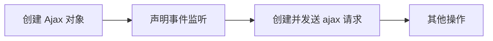

# 1 删除用户信息

> ·delUserInfo 方法
>
> 将当前用户的信息删除，浏览器会刷新当前页，转向新的响应内容页面。
>
> 缺点：不能在保留当前页的情况下，将用户删除并显示。

```sql
delete from  t_user where uid = ？;
```

```jsp
 <a class="button border-red" 
    href="data?method=delUserInfo&uid=${user.uid}" 
    onclick="return del()">
     <span class="icon-trash-o"></span> 删除
</a>

<script>
function del(){	
	return confirm("您确定要删除吗?");	
}
</script>
```

```java
//删除用户信息
	public void delUserInfo(HttpServletRequest req,HttpServletResponse resp) throws IOException{
		
			//获取请求信息
				String uid = req.getParameter("uid");
			//处理请求信息
				// 创建业务层对象
				UserService us = new UserServiceImpl();
				int i = us.delUserInfo(uid);
				if(i > 0){
					resp.getWriter().print("uid为 "+uid+" 的用户已被删除");
				}else{
					resp.getWriter().print("uid为 "+uid+" 的用户删除失败");
				}
			//响应处理结果
	}
```

# 2 AJax 技术概述和访问原理

> ajax 学习：
>
> ​    问题： 怎么在保留当前页面信息的基础上显示新的信息呢?
>
> ​    解决：使用 ajax
>
> ​    特点： 实现网页的局部刷新
>
>    应用前景:  
>
> ​		 搜索框提示语
>
> ​		 地图
>
> ​		 网页的其他功能(增加删除)

## 2.1  Ajax 访问原理

> 请求方式：
>
> ​	form 标签中 action属性
>
> ​	a 标签中 href 属性
>
> ​	js中 window.location.href=""
>
> 对于服务器来说，请求方式来自哪里服务器不知道，只处理请求。
>
> ajax 引擎对象：XMLHttpRequest 
>
> open 方法，创建请求对象
>
> send 方法，发送请求数据


## 2.2 ajax 与 非ajax

```jsp
<%@ page language="java" import="java.util.*" pageEncoding="UTF-8"%>
<%
String path = request.getContextPath();
String basePath = request.getScheme()+"://"+request.getServerName()+":"+request.getServerPort()+path+"/";
%>

<!DOCTYPE HTML PUBLIC "-//W3C//DTD HTML 4.01 Transitional//EN">
<html>
  <head>
    <base href="<%=basePath%>">
    
    <title> ajax 技术 </title>
	<meta http-equiv="pragma" content="no-cache">
	<meta http-equiv="cache-control" content="no-cache">
	<meta http-equiv="expires" content="0">    
	<meta http-equiv="keywords" content="keyword1,keyword2,keyword3">
	<meta http-equiv="description" content="This is my page">
	<!--
	<link rel="stylesheet" type="text/css" href="styles.css">
	-->
	<script type="text/javascript">
		//非 ajax
		function test(){
			
			window.location.href="my";
			
		}
		// ajax
		function testAjax(){
			//声明 ajax 对象
			var ajax;
			//创建 ajax 对象
			if(window.XMLHttpRequest){// code for IE7+, Firefox, Chrome, Opera, Safari
				// 获取 ajax 引擎对象
				ajax = new XMLHttpRequest();
				
			}else if(window.addObject){// code for IE6, IE5
				ajax = new ActiveXObject("Microsoft.XMLHTTP");
			}
			//声明 接受服务器的响应结果
			// 存储函数（或函数名），每当 readyState 属性改变时，就会调用该函数。
			ajax.onreadystatechange=function(){
				
				 //获取响应内容	
				 var data = ajax.responseText;
				 // 获取 div 对象
				 var div = document.getElementById("divShow");
				 // 将 响应显示在 div 中
				 div.innerHTML = data;
				
			}
			
			//向服务器发送请求
			ajax.open("get","my");
			ajax.send(null);
			
		}
	
		function testJs(){
			
			var  btn = document.getElementById("btn");
			//绑定事件
			btn.onclick = function(){
				
				alert("绑定事件提示");
			}
			
		}
		
	</script>
	
  </head>
  
  <body onload="testJs()">
    
    	<input type="button"  value="非ajax"  onclick="test()">
    	<input type="button"  value="ajax"  onclick="testAjax()">
    	<input type="button"  value="ajax" id="btn">
    	<hr />
    	<div id="divShow" style="width: 200px;height:200px;border:solid 1px">
    	
    	
    	</div>
    
  </body>
</html>
```


## 2.3  Ajax 流程

> 1. 创建 Ajax 引擎对象
>
> 2. 声明 事件监听：监听ajax对象的属性readyState的值，一旦 readyState 的值发生变化就会触发声明函数的执行
>
>    1. ajax 状态码 之 readyState的值
>
>       0： 表示创建 ajax 独享
>
>       1： 表示请求创建但是未发送
>
>       2： 表示请求发送
>
>       3： 请求处理完毕，正在接收响应内容
>
>       4：响应内容接收完毕
>
> 3.  创建并发送 ajax 对象
>
>    1. 创建 ajax 请求(设置异步或者同步)
>
>       ajax.open(method,url,ansyc)
>
>       method: 表示请求方式
>
>       ​	get 方法：以  ？ 方法拼接在 url 的后面参数间用 & 隔开。注意请求数据不能写在			   send方法中
>
>       ​	post 方法：需要单独的进行请求数据的设置。使用 ajax.
>
>       ​			 设置请求数据为键值对数据。如果有请求数据则 ajax.send("键值对数据&键值对数据...") ，如果没有请求数据，则 ajax.send(null)
>
>       ​	
>
>       url: 请求地址
>
>       ansyc 设置异步或者同步
>
>       ​	异步：当前 Js 函数继续执行，无须等待ajax响应及响应处理
>
>       ​	同步：当前 JS 函数不不继续执行，等待 ajax 响应及响应处理

# 3 Ajax 状态码 之 readyState

>  0： 表示创建 ajax 引擎对象
>
> 1： 表示请求创建但是未发送
>
> 2： 表示请求发送
>
> 3： 请求处理完毕，正在接收响应内容
>
> 4：响应内容接收完毕(重要状态)
>
> 通过 ajax 状态码，可以明确知道请求在什么时候创建，什么时候发送，以及什么时候接受响应数据，响应数据完全接受的状态。

```js
// 查看 ajax 状态码
alert(ajax.readyState);
```


```jsp
<%@ page language="java" import="java.util.*" pageEncoding="UTF-8"%>
<%
String path = request.getContextPath();
String basePath = request.getScheme()+"://"+request.getServerName()+":"+request.getServerPort()+path+"/";
%>

<!DOCTYPE HTML PUBLIC "-//W3C//DTD HTML 4.01 Transitional//EN">
<html>
  <head>
    <base href="<%=basePath%>">
    
    <title> ajax 技术 </title>
	<meta http-equiv="pragma" content="no-cache">
	<meta http-equiv="cache-control" content="no-cache">
	<meta http-equiv="expires" content="0">    
	<meta http-equiv="keywords" content="keyword1,keyword2,keyword3">
	<meta http-equiv="description" content="This is my page">
	<!--
	<link rel="stylesheet" type="text/css" href="styles.css">
	-->
	<script type="text/javascript">
		//非 ajax
		function test(){
			
			window.location.href="my";
			
		}
		// ajax
		function testAjax(){
			//声明 ajax 对象
			var ajax;
			//创建 ajax 对象
			if(window.XMLHttpRequest){// code for IE7+, Firefox, Chrome, Opera, Safari
				// 获取 ajax 引擎对象
				ajax = new XMLHttpRequest();
					
			}else if(window.addObject){// code for IE6, IE5
				ajax = new ActiveXObject("Microsoft.XMLHTTP");
			}
			
			//声明 接受服务器的响应结果
			// 存储函数（或函数名），每当 readyState 属性改变时，就会调用该函数。
			ajax.onreadystatechange=function(){
				//小优化
				// 当响应内容完全接受完毕时，将响应内容显示到页面中
				if(ajax.readyState == 4){
					 //获取响应内容	
					 var data = ajax.responseText;
					 // 获取 div 对象
					 var div = document.getElementById("divShow");
					 // 将 响应显示在 div 中
					 div.innerHTML = data; 						
				}
			}
			
			//向服务器发送请求
			ajax.open("get","my");
			ajax.send(null);
			
		}
	
		function testJs(){
			
			var  btn = document.getElementById("btn");
			//绑定事件
			btn.onclick = function(){
				
				alert("绑定事件提示");
			}
			
		}
		
	</script>
	
  </head>
  
  <body onload="testJs()">
    
    	<input type="button"  value="非ajax"  onclick="test()">
    	<input type="button"  value="ajax"  onclick="testAjax()">
    	<input type="button"  value="ajax" id="btn">
    	<hr />
    	<div id="divShow" style="width: 200px;height:200px;border:solid 1px">
    	
    	
    	</div>
    
  </body>
</html>

```

# 4 Ajax 响应状态码 status

> 200  表示一切正常
>
> 404 请求资源不存在
>
> 500 服务内部错误(繁忙)

```js
ajax.status == 404
```

```jsp
<%@ page language="java" import="java.util.*" pageEncoding="UTF-8"%>
<%
String path = request.getContextPath();
String basePath = request.getScheme()+"://"+request.getServerName()+":"+request.getServerPort()+path+"/";
%>

<!DOCTYPE HTML PUBLIC "-//W3C//DTD HTML 4.01 Transitional//EN">
<html>
  <head>
    <base href="<%=basePath%>">
    
    <title> ajax 技术 </title>
	<meta http-equiv="pragma" content="no-cache">
	<meta http-equiv="cache-control" content="no-cache">
	<meta http-equiv="expires" content="0">    
	<meta http-equiv="keywords" content="keyword1,keyword2,keyword3">
	<meta http-equiv="description" content="This is my page">
	<!--
	<link rel="stylesheet" type="text/css" href="styles.css">
	-->
	<script type="text/javascript">
		//非 ajax
		function test(){
			
			window.location.href="my";
			
		}
		// ajax
		function testAjax(){
			//声明 ajax 对象
			var ajax;
			//创建 ajax 对象
			if(window.XMLHttpRequest){// code for IE7+, Firefox, Chrome, Opera, Safari
				// 获取 ajax 引擎对象
				ajax = new XMLHttpRequest();
					
			}else if(window.addObject){// code for IE6, IE5
				ajax = new ActiveXObject("Microsoft.XMLHTTP");
			}
			
			//声明 接受服务器的响应结果
			// 存储函数（或函数名），每当 readyState 属性改变时，就会调用该函数。
			ajax.onreadystatechange=function(){
				//小优化
				// 当响应内容完全接受完毕时，将响应内容显示到页面中
				if(ajax.readyState == 4){
					//如果响应码正常
					if(ajax.status == 200){
						 //获取响应内容	
						 var data = ajax.responseText;
						 // 获取 div 对象
						 var div = document.getElementById("divShow");
						 // 将 响应显示在 div 中
						 div.innerHTML = data; 	
						 
						}else if(ajax.status == 404){
							 var div = document.getElementById("divShow");
							 div.innerHTML = "请求资源不存在"; 	
						}
						}else if(ajax.status == 500){
							 var div = document.getElementById("divShow");
							 div.innerHTML = "内部服务器繁忙"; 	
						}else{
							 var div = document.getElementById("divShow");
							 div.innerHTML = "未知错误"; 		
						}
	
			}
			
			//向服务器发送请求
			ajax.open("get","my");
			ajax.send(null);
			
		}
	
		function testJs(){
			
			var  btn = document.getElementById("btn");
			//绑定事件
			btn.onclick = function(){
				
				alert("绑定事件提示");
			}
			
		}
		
	</script>
	
  </head>
  
  <body onload="testJs()">
    
    	<input type="button"  value="非ajax"  onclick="test()">
    	<input type="button"  value="ajax"  onclick="testAjax()">
    	<input type="button"  value="ajax" id="btn">
    	<hr />
    	<div id="divShow" style="width: 200px;height:200px;border:solid 1px">
    	
    	
    	</div>
    
  </body>
</html>

```


# 5  异步同步技术 async

> ​	ansyc 设置异步或者同步
>
> ​	异步：当前 Js 函数继续执行，无须等待ajax响应及响应处理
>
> ​	同步：当前 JS 函数不不继续执行，等待 ajax 响应及响应处理
>
> 
>
> ​	`ajax.open(method,url,asyn);`
>
> ​	`asyn = true` 表示异步，默认为异步
>
> ​	 `asyn = false` 表示异步同步，等待服务器响应结果回来，再继续执行该函数
>
> 

```js
<%@ page language="java" import="java.util.*" pageEncoding="UTF-8"%>
<%
String path = request.getContextPath();
String basePath = request.getScheme()+"://"+request.getServerName()+":"+request.getServerPort()+path+"/";
%>

<!DOCTYPE HTML PUBLIC "-//W3C//DTD HTML 4.01 Transitional//EN">
<html>
<head>
<base href="<%=basePath%>">

<title>ajax 技术</title>
<meta http-equiv="pragma" content="no-cache">
<meta http-equiv="cache-control" content="no-cache">
<meta http-equiv="expires" content="0">
<meta http-equiv="keywords" content="keyword1,keyword2,keyword3">
<meta http-equiv="description" content="This is my page">
<!--
	<link rel="stylesheet" type="text/css" href="styles.css">
	-->
<script type="text/javascript">
		//非 ajax
		function test(){
			
			window.location.href="my";
			
		}
		// ajax
		function testAjax(){
			//声明 ajax 对象
			var ajax;
			//创建 ajax 对象
			if(window.XMLHttpRequest){// code for IE7+, Firefox, Chrome, Opera, Safari
				// 获取 ajax 引擎对象
				ajax = new XMLHttpRequest();
					
			}else if(window.addObject){// code for IE6, IE5
				ajax = new ActiveXObject("Microsoft.XMLHTTP");
			}
			
			//声明 接受服务器的响应结果
			// 存储函数（或函数名），每当 readyState 属性改变时，就会调用该函数。
			ajax.onreadystatechange=function(){
				//小优化
				// 当响应内容完全接受完毕时，将响应内容显示到页面中
				if(ajax.readyState == 4){
					//如果响应码正常
					if(ajax.status == 200){
						 //获取响应内容	
						 var data = ajax.responseText;
						 // 获取 div 对象
						 var div = document.getElementById("divShow");
						 // 将 响应显示在 div 中
						 div.innerHTML = data; 		 
					}else if(ajax.status == 404){
						 var div = document.getElementById("divShow");
						 div.innerHTML = "请求资源不存在"; 	
					}else if(ajax.status == 500){
						 var div = document.getElementById("divShow");
						 div.innerHTML = "内部服务器繁忙"; 	
					}else{
						 var div = document.getElementById("divShow");
						 div.innerHTML = "未知错误"; 		
					}
				}
			}
			
			//创建 ajax 请求
			ajax.open("get","my",false);
			//发送 ajax 请求
			ajax.send(null);
			//异步同步
			alert("异步同步");
			
		}
	
		function testJs(){
			
			var  btn = document.getElementById("btn");
			//绑定事件
			btn.onclick = function(){
				
				alert("绑定事件提示");
			}
			
		}
		
	</script>

</head>

<body onload="testJs()">

	<input type="button" value="非ajax" onclick="test()">
	<input type="button" value="ajax" onclick="testAjax()">
	<input type="button" value="ajax" id="btn">
	<hr />
	<div id="divShow" style="width: 200px;height:200px;border:solid 1px">


	</div>

</body>
</html>

```


# 6 Get 和 Post 请求方法

> get 方法：以  ？ 方法拼接在 url 的后面参数间用 & 隔开。
>
> ​		注意请求数据不能写在send方法中。
>
> post 方法：需要单独的进行请求数据的设置。使用 ajax.
>
> ​	         设置请求数据为键值对数据。如果有请求数据则 ajax.send("键值对数据&键值对数据...") ，
>
> ​		  如果没有请求数据，则 ajax.send(null)

```js
//创建 ajax 请求
ajax.open("get","my?uname=张三&pwd=123",false);
//发送 ajax 请求
ajax.send(null);
```

```javascript
// post 请求
// 创建 ajax 请求
ajax.open("post", "my", false);
//设置请求头
ajax.setRequestHeader("Content-Type", "application/x-www-form-urlencoded")
//发送 ajax 请求
ajax.send("uname=张三&pwd=123");
```


# 7 Json 对象与响应数据

## 7.1 Json 对象

> json 是一种 Js 创建对象中声明的一种格式
>
> 使用 Json 对象的好处：保证对象中数据的紧密性和完整性
>
> 使用 ：在服务器端将要响应的数据拼接成 json 格式的字符串。这样客户端（浏览器端）在接受到响应数据后可以 使用 eval 方法将 json 格式的字符串数据直接转换为 对应的 JS 对象，便于数据的操作。在服务器端使用类似 Gson 的工具包完成 json格式的字符串的拼接。
>
> Json 的格式：

```json
var 对象名 = {

	键名："值"，
	键名："值"，
	...
	键名："值"，
}
```


```js
//第一种方法创建 json 对象
var obj = {};
obj.name = "张三";
obj.pwd = "123";
//第二种方法创建 json 对象
var obj2 = {
    name:"李四",
    pwd:"123",
    sex:"男"
};
//输出
alert(obj.name+"  "+obj2.name);
```

## 7.2 Ajax 之 响应数据

> 服务器响应给浏览器的数据应该是字符串类型
>
> 但是如果数据量比较大，我们就需要在服务端将数据拼接上一个良好的字符串格式数据，
>
> 响应给浏览器根据格式进行数据的解析和使用
>
> 问题： 
>
> ​	什么昂的格式算是良好格式呢？
>
> 解决：
>
> ​	使用 json 数据格式  
>
> ​	使用  js 中 eval 方法将字符串转成 JS 对象
>
> 

```java
package cn.szxy.servlet;

import java.io.IOException;
import java.io.PrintWriter;

import javax.servlet.ServletException;
import javax.servlet.ServletRequest;
import javax.servlet.ServletResponse;
import javax.servlet.http.HttpServlet;
import javax.servlet.http.HttpServletRequest;
import javax.servlet.http.HttpServletResponse;

import com.google.gson.Gson;

import cn.szxy.pojo.User;

public class MyAjax extends HttpServlet {
	
		@Override
		protected void service(HttpServletRequest req, HttpServletResponse resp)
				throws ServletException, IOException {
				
			
					//设置请求编码格式
					req.setCharacterEncoding("utf-8");
					//设置响应编码格式
					resp.setContentType("text/html;charset=utf-8");
					//获取请求数据
					String uname = req.getParameter("uname");
					String pwd = req.getParameter("pwd");
					
					System.out.println(uname+"----"+pwd);
					
					try {
						new Thread().sleep(2000);
					} catch (InterruptedException e) {
						e.printStackTrace();
					}
					//处理请求数据
					//int i = 1/0;
					User user = new User();
					user.setName("张三");
					user.setPwd("123");
					user.setSex("男");
					user.setAge(20);
					
					//将 user 对象中的数据转换成 json 格式的数据
				//	String str = new String("{uname:'张三',pwd:'123',sex:'男',age:20}");
					String str= new Gson().toJson(user);
					System.out.println(str);
					
					//响应处理结果
					PrintWriter out = resp.getWriter();
					/*out.write("ajax学习");*/
					out.write(str);
				
		}
}


```

```jsp
<%@ page language="java" import="java.util.*" pageEncoding="UTF-8"%>
<%
String path = request.getContextPath();
String basePath = request.getScheme()+"://"+request.getServerName()+":"+request.getServerPort()+path+"/";
%>

<!DOCTYPE HTML PUBLIC "-//W3C//DTD HTML 4.01 Transitional//EN">
<html>
<head>
<base href="<%=basePath%>">

<title>ajax 技术</title>
<meta http-equiv="pragma" content="no-cache">
<meta http-equiv="cache-control" content="no-cache">
<meta http-equiv="expires" content="0">
<meta http-equiv="keywords" content="keyword1,keyword2,keyword3">
<meta http-equiv="description" content="This is my page">
<!--
	<link rel="stylesheet" type="text/css" href="styles.css">
	-->
<script type="text/javascript">
		//非 ajax
		function test(){
			
			window.location.href="my";
			
		}
		// ajax
		function testAjax(){
			//声明 ajax 对象
			var ajax;
			//创建 ajax 对象
			if(window.XMLHttpRequest){// code for IE7+, Firefox, Chrome, Opera, Safari
				// 获取 ajax 引擎对象
				ajax = new XMLHttpRequest();
					
			}else if(window.addObject){// code for IE6, IE5
				ajax = new ActiveXObject("Microsoft.XMLHTTP");
			}
			
			//声明 接受服务器的响应结果
			// 存储函数（或函数名），每当 readyState 属性改变时，就会调用该函数。
			ajax.onreadystatechange=function(){
				//小优化
				// 当响应内容完全接受完毕时，将响应内容显示到页面中
				if(ajax.readyState == 4){
					//如果响应码正常
					if(ajax.status == 200){
						 //获取响应内容	
						 var data = ajax.responseText;
						 //处理响应内容
						 eval("var obj="+data);
						 // 获取 div 对象
						 var div = document.getElementById("divShow");
						 // 将 响应显示在 div 中
						 div.innerHTML = obj.name; 		 
					}else if(ajax.status == 404){
						 var div = document.getElementById("divShow");
						 div.innerHTML = "请求资源不存在"; 	
					}else if(ajax.status == 500){
						 var div = document.getElementById("divShow");
						 div.innerHTML = "内部服务器繁忙"; 	
					}else{
						 var div = document.getElementById("divShow");
						 div.innerHTML = "未知错误"; 		
					}
				}
			}
			
			// get 请求
			/* //创建 ajax 请求
			ajax.open("get","my?uname=张三&pwd=123",false);
			//发送 ajax 请求
			ajax.send(null); */
			// post 请求
			// 创建 ajax 请求
			ajax.open("post", "my", false);
			//设置请求头
			ajax.setRequestHeader("Content-Type", "application/x-www-form-urlencoded")
			//发送 ajax 请求
			ajax.send("uname=张三&pwd=123");
			
			//异步同步
			 var div = document.getElementById("divShow");			
			alert(div.innerHTML);
			
		}
	
		function testJs(){
			
			var  btn = document.getElementById("btn");
			//绑定事件
			btn.onclick = function(){
				
				alert("绑定事件提示");
			}
			
		}
		
		//第一种方法创建 json 对象
		var obj = {};
		obj.name = "张三";
		obj.pwd = "123";
		//第二种方法创建 json 对象
		var obj2 = {
				name:"李四",
				pwd:"123",
				sex:"男"
		};
		//输出
		alert(obj.name+"  "+obj2.name);
		
	</script>

</head>

<body onload="testJs()">

	<input type="button" value="非ajax" onclick="test()">
	<input type="button" value="ajax" onclick="testAjax()">
	<input type="button" value="ajax" id="btn">
	<hr />
	<div id="divShow" style="width: 200px;height:200px;border:solid 1px">


	</div>

</body>
</html>

```

# 8 Ajax 流程

> 1. 创建 ajax 引擎对象  XMLHttpRequest
>
> 2. 声明事件监听
>
>    ​	ajax 状态码等于 4
>
>    ​		 ajax 响应码
>
>    ​			获取响应内容(普通格式字符串或者 Json格式的字符串)
>
>    ​			处理响应内容
>
> 3. 创建并发送 ajax 请求
>
>    1. 创建 ajax 请求(请求方式，请求地址，同步或异步)
>    2. 发送 ajax 请求
>
> 4. 其他操作




# 9 用户注册

> 功能：用户名是否被注册校验
>
> 思路：
>
>  	1. 用户书写用户名信息，在失去焦点是进行用户校验
>  	2. 失去焦点发送请求到服务器，服务器根据用户名信息去数据库中查询该用户名是否存在
>  	3. 将校验结果响应客户端
>  	4. 在当前页面，失去焦点后用户名输入框后显示提示语
>
> 技术：
>
> ​	使用 ajax 技术

## 9.1 前端代码

```jsp
<%@ page language="java" import="java.util.*" pageEncoding="UTF-8"%>
<%
String path = request.getContextPath();
String basePath = request.getScheme()+"://"+request.getServerName()+":"+request.getServerPort()+path+"/";
%>

<!DOCTYPE HTML PUBLIC "-//W3C//DTD HTML 4.01 Transitional//EN">
<html>
  <head>
    <base href="<%=basePath%>">
    
    <title>注册</title>
    
	<meta http-equiv="pragma" content="no-cache">
	<meta http-equiv="cache-control" content="no-cache">
	<meta http-equiv="expires" content="0">    
	<meta http-equiv="keywords" content="keyword1,keyword2,keyword3">
	<meta http-equiv="description" content="This is my page">
	
	<script>
		// 检查用户是否已被注册
		function checkName(){
			// 创建 ajax 对象
			var ajax = null;
			if(window.XMLHttpRequest){
				ajax = new XMLHttpRequest();
			}else if(window.addObject){// code for IE6, IE5
				ajax = new ActiveXObject("Microsoft.XMLHTTP");
			}
			//声明事件监听
			ajax.onreadystatechange=function(){
				//判断 ajax 状态码
				if(ajax.readyState == 4){
					//判断 ajax 响应码
					if(ajax.status == 200){
						// 获取响应内容
						var data = ajax.responseText;
						// 处理响应内容
						var span = document.getElementById("unameSpan");
						if(eval(data)){
							span.innerHTML = "用户名 OK";
							span.style.color = "green";
						}else{
							span.innerHTML = "用户名已被注册";
							span.style.color = "red";
						}
					}
				}
			} 
			
			// 创建并发送请求
			//声明事件监听
			var input = document.getElementById("uname");
			var val = input.value;
			ajax.open("get", "data?uname="+val,true);
			//发送请求
			ajax.send(null);
		}
		
	</script>
  </head>
  
  <body>
   		<form action="#" >
   			<label>用户名: </label>
   			<input type="text" name="uname" id="uname" onblur="checkName()"/>&nbsp;<span id="unameSpan"></span>
   		</form>
   
   
  </body>
</html>

```

## 9.2 后端代码

```java
package cn.szxy.web;

import java.io.IOException;

import javax.servlet.ServletException;
import javax.servlet.http.HttpServlet;
import javax.servlet.http.HttpServletRequest;
import javax.servlet.http.HttpServletResponse;

import cn.szxy.service.DataService;
import cn.szxy.service.impl.DataServiceImpl;

public class DataServlet extends HttpServlet {
	//声明  业务层对象
	DataService service = new DataServiceImpl();
	@Override
	protected void service(HttpServletRequest req, HttpServletResponse resp)
			throws ServletException, IOException {
			
			//设置请求编码格式
			req.setCharacterEncoding("utf-8");
			//设置响应编码格式
			resp.setContentType("text/html;charset=utf-8");
			//获取请求数据
			String uname = req.getParameter("uname");
			//处理请求数据
			boolean flag = service.selUserByName(uname);
			//响应处理结果
			if(!flag){//表示该用户名未被注册
				resp.getWriter().write("true");//直接响应 true ,可以降低 前端与后端之间的耦合
			}else{//表示该用户名已被注册
				resp.getWriter().write("false");
			}
	}
}

```

```java
package cn.szxy.service.impl;

import cn.szxy.dao.DataDao;
import cn.szxy.dao.impl.DataDaoImpl;
import cn.szxy.service.DataService;

public class DataServiceImpl implements DataService{
	// 获取 dao 层对象
	DataDao dao = new DataDaoImpl();
	
	//根据用户名查询指定用户信息
	@Override
	public boolean selUserByName(String uname) {
		return dao.selUserByName(uname);
	}

}

```

```java
package cn.szxy.dao.impl;

import java.sql.Connection;
import java.sql.PreparedStatement;
import java.sql.ResultSet;
import java.sql.SQLException;

import cn.szxy.dao.DataDao;
import cn.szxy.util.DBUtil;


public class DataDaoImpl implements DataDao{

	// 查询用户是否已经被注册
	@Override
	public boolean selUserByName(String uname) {
		//声明变量
		Connection conn = null;
		PreparedStatement pstmt = null;
		ResultSet rs = null;
		// 判断用户是否已被注册的标志，false 表示未被注册
		boolean flag = false;
		try {
			//获取数据库连接
			conn = DBUtil.getConnection();
			//定义 sql 语句
			String sql = "select * from t_user where name = ?";
			//获取 预处理发射器
			pstmt = conn.prepareStatement(sql);
			//占位符
			pstmt.setString(1, uname);
			//执行 sql 语句，得到结果集
			rs = pstmt.executeQuery();
			if(rs.next()){
				flag = true;
			}
			//判断
		} catch (SQLException e) {
			e.printStackTrace();
		}finally{
			//关闭资源
			DBUtil.closeAll(rs, pstmt, conn);
		}
		//返回结果
		return flag;
	}

}
```

## 9.3 效果图


# 10  Ajax 封装

> 解决：编写代码时出现了重复编写，影响了开发的效率
>
> 实现：相同的保留，不同的传参
>
> 请求方式：method
>
> 请求地址：url
>
> 请求参数：data 请求参数的格式为键值对，不同的键值对使用&隔开
>
> ​		 实例："a=1&b=2"
>
> 异步同步设置：ansyc
>
> 响应处理函数：deal200 该参数接受一个 JS 的 函数对象，函数对象中声明 ajax 响应数据的处理逻辑代码。
>
> ​			注意：函数对象需要声明一个形参用来接受要处理的响应数据
>
> JS 函数可以不传值，默认值

- ajax.js

```js
/**
 * 封装 Ajax 工具类
 * @param method  	请求方式 Get、Post
 * @param url    	请求地址
 * @param data	  	请求路径
 * @param deal200	处理请求的函数
 * @param ansyc		异步同步
 */
function myAjax(method, url, data, deal200, ansyc) {
	//创建 ajax 引擎对象
	var ajax = null;
	//判断浏览器类型
	if(window.XMLHttpRequest){
		ajax = new XMLHttpRequest();
	}else if(window.addObject){// code for IE6, IE5
		ajax = new ActiveXObject("Microsoft.XMLHTTP");
	}
	
	//声明事件监听
	ajax.onreadystatechange = function() {
		//判断 ajax状态码   等于4表示响应结果接受完毕
		if (ajax.readyState == 4) {
			//判断 ajax 响应码
			if (ajax.status == 200) {
				//获取响应数据
				var data = ajax.responseText;
				if (deal200) {
					deal200(data);
				}
			}
		}
	}

	//判断请求方式
	if (method == "get") {
		
		//创建并发送 ajax 请求
		ajax.open(method, url + (data == null ? "" : "?"+data), ansyc);
		ajax.send(null);
		
	} else if (method == "post") {
		
		//创建 ajax 请求
		ajax.open(method, url, ansyc);
		//设置请求头,以键值对的方式发送表单数据
		ajax.setRequestHeader("Content-Type",
				"application/x-www-form-urlencoded");
		//发送 ajax 请求	
		ajax.send((data == null ? "" : data));
	}

}
```

- 测试 ajax.js 工具类

```html
<%@ page language="java" import="java.util.*" pageEncoding="UTF-8"%>
<%
String path = request.getContextPath();
String basePath = request.getScheme()+"://"+request.getServerName()+":"+request.getServerPort()+path+"/";
%>

<!DOCTYPE HTML PUBLIC "-//W3C//DTD HTML 4.01 Transitional//EN">
<html>
  <head>
    <base href="<%=basePath%>">
    
    <title>封装 Ajax </title>
    <!--  引入 ajax 工具类 -->  
  	<script type="text/javascript"  src="js/ajaxUtil.js"></script>
  	
  	<script type="text/javascript">
  		// 调用 工具类
		myAjax("get","/ajax/my",null,function(data){
			alert("Test");
			alert(data);
		},true);
  	</script>
	
  </head>
  
  <body>
  	<input type="button" value="测试 ajax"  onclick="myAjax()">
  
  </body>
</html>
```


# 11  Jquery 封装  AJax

> Jquery 是 Js 的一个轻量性框架，已经将 JS 创建的操作进行了封装，而 Ajax 也是
>
> 一部分，所以 JQuery 也已经将 ajax 进行了封装。

## 11.1  封装

````javascript
$.get(url,data,function)   //get  请求方式   适用于简单的业务逻辑规则
$.post(url,data,function)  //post 请求方式   适用于简单的业务逻辑规则
$.ajax({json格式})  // 适用于复杂的业务逻辑规则

// url 请求地址
// data 请求参数
 
````

## 11.2 栗子

```html
<script>
	// ajax 方式发送请求
    $.ajax({
    type: "get",
    url: "data",
    data: "uname="+$("#uname").val(),
    success: function(data){alert(data)}
    });
</script>

```

```html
<!-- 引入 Jquery  -->
<script type="text/javascript" src="js/jquery.js"></script>
<script>
    $(function(){
        $("#uname").blur(function(){
            $.get("data",{uname:($("#uname").val())},function(data){
                // 处理响应内容
                var span = $("#unameSpan");
                if(eval(data)){
                    span.html("用户名 OK");
                    span.css("color","green");
                }else{
                    span.html("用户名已被注册");
                    span.css("color","red");
                }
            });
        });
    });
</script>
  
```

# 12 Ajax 案例之省市区三级联动

> 三级联动定义：页面中有三个下拉框选项，分别为
>
> 省、市、县下拉框，选择对应的框，显示对应的省、市、县信息。
>
> 技术分析：ajax技术+jsp+servlet+jdbc
>
> 需求分析（思路）：
>
> ​	1、 创建页面：页面中有三个下拉框，分别为省、市、县区
>
> ​	2、页面加载成功发起 ajax 请求，请求省的信息，并将响应的经过填充到省下拉框中
>
> ​	3、选择省信息，请求对应的市信息，并将响应结果填充到下拉框中
>
> ​	4、选择市信息，请求对应的区/县信息，并将响应结果填充到下拉框中
>
> 数据库设计：
>
> ​	创建表（area） ： 存储了省、市、区/县信息
>
> ​	设计表实现一：只存储了数据，但是数据的层次关系没有体现
>
> ​		地区id：areaid
>
> ​		地区名：areaname
>
> ​	设计表实现二：
>
> ​		地区id：areaid
>
> ​		地区名：areaname
>
> ​		地区上级id：parentid 
>
> ​	sql语句设计：
>
> ​		查询所有的省信息 ：select * from area where parentid=0; 
>
> ​		查询选择的省下的市信息（假如：选择的省的areaid 为110000）
>
> ​						select * from area  where areaid  = 110000；
>
> ​		查询选择市下的县/区信息（假如：选择的市的areaid 为120000）：
>
> ​						select * from area where areaid =  120000；
>
> ​		代码： select  * from area  where areaid = ？；
>
> ​	数据库实现：导入 area.sql 语句执行
>
> 代码缺陷：
>
> ​	代码的重复冗余大
>
> 解决：相同的保留，不同的传参
>
> 

​		

## 12.1 代码实现

> 只展现前端代码，后面只做一个事情。
>
> bug，选择每个下拉框的第一个地区，体验不好。

### 12.1.1 未加联动

```html
<%@ page language="java" import="java.util.*" pageEncoding="UTF-8"%>
<%
String path = request.getContextPath();
String basePath = request.getScheme()+"://"+request.getServerName()+":"+request.getServerPort()+path+"/";
%>

<!DOCTYPE HTML PUBLIC "-//W3C//DTD HTML 4.01 Transitional//EN">
<html>
  <head>
    <base href="<%=basePath%>">
    <title>地区</title>
    <!-- 导入 Jquery  -->
    <script type="text/javascript" src="js/jquery.js"></script>
    <script>
  		$(function(){
  			$.get("area",{"parentid":0},function(data){
    		/* 	 alert(data); */
    			//将字符串对象转为 JS 对象
    			eval("var areas ="+data);
    			//获取省下拉框
    			var prov = $("#province");
    			//清空省下拉框
    			prov.empty();
    			//将所有省的信息填充到省下拉框中
    			for(var i=0;i < areas.length;i++){
    				console.log(i+"\t"+areas[i].areaname);
    				prov.append("<option value="+areas[i].areaid+">"+areas[i].areaname+"</option>");
    			}
    			//选择对应省下的市信息
    			$("#province").change(function(data){
    				//获取省的地区号
    				var areaid = $("#province").val();
    				/* alert(areaid); */
    				$.get("area",{"parentid":areaid},function(data){
    					//将字符串对象转为 JS 对象
    					eval("var areas="+data);
    					//获取区对象
    					var city = $("#city");
    					//清空市下拉框
    					city.empty();
    					//将所有市的信息填充到市下拉框
    					for(var i=0;i<areas.length;i++){
    						city.append("<option value="+areas[i].areaid+">"+areas[i].areaname+"</option>")
    					}
    				});
    			});
    			//获取区/县信息
    			$("#city").change(function(){
    				//获取市的地区号
    				var areaid = $("#city").val();
    				//ajax 请求
    				$.get("area",{parentid:areaid},function(data){
    					//将字符串对象转为 JS 对象
    					eval("var areas="+data);
    					//获取区/县
    					var area = $("#area");
    					//清空下拉框
    					area.empty();
    					for(var i=0;i<areas.length;i++){
    						area.append("<option value="+areas[i].areaid+">"+areas[i].areaname+"</option>")
    					}
    				});
    				
    			});
    			//选择对应市下的区/县信息
    			
    		});
  		});
    	
    </script>
  </head>
  
  <body style="background-color:gray;">
  		<div style="margin:auto;width:1000px;margin-top:200px;">
			<h1 style="text-align: center;font-weight:500;font-family:楷体;">地区选择三级联动</h1> 
  			 省/直辖市：<select id="province" name="" style="width:180px;height: 30px;border-radius:6px;"><option>dsf</option></select>
  			 市:<select id="city" name="" style="width:180px;height: 30px;border-radius:6px;"></select>
  			县/区：<select name="" id="area" style="width:180px;height: 30px;border-radius:6px;"></select>	
  		</div>
    	
  </body>
</html>

```

### 12.1.2 添加联动

```html
<%@ page language="java" import="java.util.*" pageEncoding="UTF-8"%>
<%
String path = request.getContextPath();
String basePath = request.getScheme()+"://"+request.getServerName()+":"+request.getServerPort()+path+"/";
%>

<!DOCTYPE HTML PUBLIC "-//W3C//DTD HTML 4.01 Transitional//EN">
<html>
  <head>
    <base href="<%=basePath%>">
    <title>地区</title>
    <!-- 导入 Jquery  -->
    <script type="text/javascript" src="js/jquery.js"></script>
    <script>
  		$(function(){
  			//获取省信息
  			$.get("area",{"parentid":0},function(data){
    		/* 	 alert(data); */
    			//将字符串对象转为 JS 对象
    			eval("var areas ="+data);
    			//获取省下拉框
    			var prov = $("#province");
    			//清空省下拉框
    			prov.empty();
    			//将所有省的信息填充到省下拉框中
    			for(var i=0;i < areas.length;i++){
    				/* console.log(i+"\t"+areas[i].areaname); */
    				prov.append("<option value="+areas[i].areaid+">"+areas[i].areaname+"</option>");
    			}
    			//填充省下拉框时触发市的信息,联动的关键
    			 $("#province").trigger("change");
    		});
  			//选择对应省下的市信息
			$("#province").change(function(data){
				//获取省的地区号
				var areaid = $("#province").val();
				/* alert(areaid); */
				$.get("area",{"parentid":areaid},function(data){
					//将字符串对象转为 JS 对象
					eval("var areas="+data);
					//获取区对象
					var city = $("#city");
					//清空市下拉框
					city.empty();
					//将所有市的信息填充到市下拉框
					for(var i=0;i<areas.length;i++){
						city.append("<option value="+areas[i].areaid+">"+areas[i].areaname+"</option>");
					}
					////填充市下拉框时触发区/县的信息，联动的关键
					$("#city").trigger("change");
				});
			});
  			
			//获取区/县信息
			$("#city").change(function(){
				//获取市的地区号
				var areaid = $("#city").val();
				//ajax 请求
				$.get("area",{parentid:areaid},function(data){
					//将字符串对象转为 JS 对象
					eval("var areas="+data);
					//获取区/县
					var area = $("#area");
					//清空下拉框
					area.empty();
					for(var i=0;i<areas.length;i++){
						area.append("<option value="+areas[i].areaid+">"+areas[i].areaname+"</option>");
					}
				});
				
			});
			//选择对应市下的区/县信息
			
  			
  			
  		});
    	
    </script>
  </head>
  
  <body style="background-color:gray;">
  		<div style="margin:auto;width:720px;margin-top:200px;">
			<h1 style="text-align: center;font-weight:500;font-family:楷体;margin-bottom: 50px;">地区选择三级联动</h1> 
  			 省/直辖市：<select id="province" name="" style="width:180px;height: 30px;border-radius:6px;"><option></option></select>
  			 市:<select id="city" name="" style="width:180px;height: 30px;border-radius:6px;"></select>
  			县/区：<select name="" id="area" style="width:180px;height: 30px;border-radius:6px;"></select>	
  		</div>
    	
  </body>
</html>

```

### 12.1.3 封装

```html
<%@ page language="java" import="java.util.*" pageEncoding="UTF-8"%>
<%
String path = request.getContextPath();
String basePath = request.getScheme()+"://"+request.getServerName()+":"+request.getServerPort()+path+"/";
%>

<!DOCTYPE HTML PUBLIC "-//W3C//DTD HTML 4.01 Transitional//EN">
<html>
  <head>
    <base href="<%=basePath%>">
    <title>地区</title>
    <!-- 导入 Jquery  -->
    <script type="text/javascript" src="js/jquery.js"></script>
    <script>
  		$(function(){
  			//获取省信息
  			getArea("province", 0);
  			//选择对应省下的市信息
			$("#province").change(function(data){
				//获取省的地区号
				var areaid = $("#province").val();
				getArea("city",areaid);
			});
  			
			//获取区/县信息
			$("#city").change(function(){
				//获取市的地区号
				var areaid = $("#city").val();
				getArea("area",areaid);
			});
			//封装
			function getArea(areaname,sid){
   				//获取地区信息
    			 $.get("area",{"parentid":sid},function(data){
    				//将字符串对象转为 JS 对象
    	    			eval("var areas ="+data);
    	    			//获取省下拉框
    	    			var prov = $("#"+areaname);
    	    			//清空省下拉框
    	    			prov.empty();
    	    			//将所有省的信息填充到省下拉框中
    	    			for(var i=0;i < areas.length;i++){
    	    				prov.append("<option value="+areas[i].areaid+">"+areas[i].areaname+"</option>");
    	    			}
    	    			//填充省下拉框时触发市的信息
    	    			$("#"+areaname).trigger("change");		
    		    });
			}
  		});
    	
    </script>
  </head>
  
  <body style="background-color:gray;">
  		<div style="margin:auto;width:720px;margin-top:200px;">
			<h1 style="text-align: center;font-weight:500;font-family:楷体;margin-bottom: 50px;">地区选择三级联动</h1> 
  			 省/直辖市：<select id="province" name="" style="width:180px;height: 30px;border-radius:6px;"><option></option></select>
  			 市:<select id="city" name="" style="width:180px;height: 30px;border-radius:6px;"></select>
  			县/区：<select name="" id="area" style="width:180px;height: 30px;border-radius:6px;"></select>	
  		</div>
    	
  </body>
</html>

```


## 12.2 效果图

- 未加联动


- 加联动


## 12.3 总结

1. 良好的数据库设计，可让后期操作更加便捷。

   ```sql
   select  * from area  where areaid = ？；
   ```

2. 实现联动的代码**举例**：

```html
<script>
	//填充省下拉框时触发市的信息,联动的关键
	$("#province").trigger("change");	
</script>
```

# 13 ajax 案例之搜索框提示语

> 功能需求：
>
> ​	用户再搜索框中输入关键字，然后搜索框习出现下拉选项，提示关键字的提示语
>
> ​	用户可以使用鼠标进行提示语的选择，也可以使用键盘的上下键选择
>
> 技术分析：
>
> ​	ajax技术+servlet+jsp+jdbc
>
> 功能分析（思路）：
>
> ​	1、创建搜索界面（搜索框和提示语div 和搜索按钮）
>
> ​	2、 给搜索框添加 onkeyup 时间， 键盘弹起时发送 ajax 请求
>
> ​		请求当前用户输入的信息对应的提示语数据
>
> ​	3、将提示语数据填充到搜索框下的div 中
>
> ​	4、实现使用鼠标选择提示语
>
> ​	5、实现使用键盘的上和下键选择提示语
>
> ​	6、实现鼠标和键盘的联动操作
>
> ​	7、将显示提示语的 div 进行隐藏，当有提示语的时候进行显示
>
> 完善：
>
> ​	问题：只要用户在搜索框中出现键盘点击动作，都会触发键盘事件的执行
>
> ​	而只要数据符合要求，都会发送 ajax 请求，请求提示语信息。点击一次都发一次。
>
> ​	但是其实只需求最后一次进行请求发生即可。
>
> ​	解决1：
>
> ​		使用延迟发送请求
>
> ​	使用1：
>
> ​		window.setTimeout()
>
> ​	问题2：
>
> ​		even 对象在火狐浏览器中使用window.event 获取不到
>
> ​	解决：
>
> ​		函数声明形参 event，必须是event 
>
> ​	 var reg =  /^\s+$/g/ 空格校验

> 数据库设计：
>
> ​	创建表：（data）存储了常用的关键字数据
>
> ​		关键字编号：id
>
> ​		关键字数据：title 	
>
> ​		次数：count
>
> ​		说明：remark
>
> ​	添加测试数据：要求前期测试数据为英文单词
>
> ​	SQL 语句设计：查询以用户当前搜索框数据开头的关键字	
>
> ​			select * from data where title  like 'a%';
>
> ​	


## 13.1 添加鼠标悬停事件

> 小技巧：将 css 赋于空字符串，即可清空属性值
>
> 注意：事件一定是添加已经存在的 html 代码上的，即注意事件添加的位置

```html
<script>
	// 等服务器把提示语发送给客户端，再添加鼠标放上事件
    $("#prompt-box div").mouseover(function(){
        //清空提示框中提示语的背景颜色
        $("#prompt-box div").css("background-color",""); 
        //选择当前鼠标选择的 div ,并修改其 div 上的背景颜色
        $(this).css("background-color","gray");
        //获取当前选择提示语的位置
        count = $(this).index();
        //通过鼠标单击提示语，将提示语放在搜索框中
        $(this).click(function(){
            $("#input-search").val($(this).html());
            //隐藏 提示语 div
            $("#prompt-box").css("display","none");
        });
    }); 
</script>
```

## 13.2 键盘上下键选择

> 选择当前 div 的位置，通过全局变量 count 控制。

```html
<script>
    //添加键盘下键，选择提示语
    if(code == 40 ||code == 38){
        var divLength = ($("#prompt-box div").length-1);
        //注意要使用 ++count，而不是 count++
        if(code == 40){
            count = count < divLength?++count:0;						
        }else{
            count = count >= 0?--count:divLength;
        }
        //清空提示语背景颜色
        $("#prompt-box div").css("background-color","");
        //选择提示语，修改背景颜色
        $("#prompt-box div:eq("+count+")").css("background-color","gray");	
        //将提示语放入搜索框中
        $("#input-search").val($("#prompt-box div:eq("+count+")").html());
    }	
</script>
```

## 13.3 获取键盘输入的 javascript 码值

> 利用 BOM 对象中 window.event.keyCode 
>
> 注意：keyCode 中 k  小写

```html
<script>
    var event = window.event || event;
    // 获取 javascript 对应的键盘的值
    var code  = event.keyCode; //k 小写
    // code = 8  表示删除键
    if((code >=65 && code <=90) || code == 8 || code == 32 || (code >=49 && code <=57)){
    	//省略代码
    }
</script>
```

##  13.4 延迟函数

> var id = window.setTimeout(function(){},delay) ,注意 id 相当于线程号
>
> window.clearTimeout(id) ，清空当前延时线程，防止每次键盘弹出都发送一个 ajax 请求，浪费资源

```html
<script>
// 清空延时 线程，防止每次键盘弹出都发送一个 ajax 请求，浪费资源
window.clearTimeout(id);
// 设置延时,延迟发送 ajax
id = window.setTimeout(function(){
$.get("search",{title:search_title},function(sdata){
/* alert(sdata);  */
eval("var data="+sdata);
if(data.length > 0){//有提示语才显示提示框
// 显示提示框
$("#prompt-box").css("display","");
}
//清空提示框中的内容
$("#prompt-box").empty();
//注意单词使用 区分 sdata ，data
for(var i=0;i<data.length-1;i++){
   $("#prompt-box").append("<div style='margin-bottom:3px;'>"+data[i].title+"</div>");	    }
// 等服务器把提示语发送给客户端，再添加鼠标放上事件
$("#prompt-box div").mouseover(function(){
	//清空提示框中提示语的背景颜色
	 $("#prompt-box div").css("background-color",""); 
   		 //选择当前鼠标选择的 div ,并修改其 div 上的背景颜色
   		 $(this).css("background-color","gray");

    	 //获取当前选择提示语的位置
     	 count = $(this).index();
    	 //通过鼠标单击提示语，将提示语放在搜索框中
      	 $(this).click(function(){
         $("#input-search").val($(this).html());
         //隐藏 提示语 div
         $("#prompt-box").css("display","none");
 	});
  			}); 
 	});		
  }, 500);				
</script>
```


## 13. 5 代码

```html
<%@ page language="java" import="java.util.*" pageEncoding="UTF-8"%>
<%
String path = request.getContextPath();
String basePath = request.getScheme()+"://"+request.getServerName()+":"+request.getServerPort()+path+"/";
%>

<!DOCTYPE HTML PUBLIC "-//W3C//DTD HTML 4.01 Transitional//EN">
<html>
  <head>
    <base href="<%=basePath%>">
    <title>搜索框提示语</title>
    <!-- 导入 Jquery 库 -->
    <script type="text/javascript" src="js/jquery.js"></script>
    <script type="text/javascript">
		$(function(){
			// 计数器
			var count = -1;
			// 获取当前 延时线程的 id 
			var id = null;
			/* 键盘弹起 */
			$("#input-search").keyup(function(event){//形参 event，兼容低版本的火狐浏览器
				//只发送符合条件的关键字数据
				//获取 event 对象
				var event = window.event || event;
				// 获取 javascript 对应的键盘的值
				var code  = event.keyCode; //k 小写
				// code = 8  表示删除键
				if((code >=65 && code <=90) || code == 8 || code == 32 || (code >=49 && code <=57)){
					// 发送 ajax 请求,返回响应是搜索提示语语句
					var search_title = $("#input-search").val(); 
					/* alert(search_title); */
					//判断搜索框中的值是否空，若为空，则直接返回
					if(search_title == ""){
						//清空提示框中提示语
						$("#prompt-box").empty();
						return; //即不执行下面的代码，不发送 ajax 请求
					}
					// 清空延时 线程，防止每次键盘弹出都发送一个 ajax 请求，浪费资源
					window.clearTimeout(id);
					// 设置延时,延迟发送 ajax
					id = window.setTimeout(function(){
						$.get("search",{title:search_title},function(sdata){
							 /* alert(sdata);  */
							eval("var data="+sdata);
							if(data.length > 0){//有提示语才显示提示框
								// 显示提示框
							 	$("#prompt-box").css("display","");
							}
							//清空提示框中的内容
							$("#prompt-box").empty();
							//注意单词使用 区分 sdata ，data
							for(var i=0;i<data.length-1;i++){
								$("#prompt-box").append("<div style='margin-bottom:3px;'>"+data[i].title+"</div>");					
							}
							// 等服务器把提示语发送给客户端，再添加鼠标放上事件
							$("#prompt-box div").mouseover(function(){
								//清空提示框中提示语的背景颜色
							 	$("#prompt-box div").css("background-color",""); 
								//选择当前鼠标选择的 div ,并修改其 div 上的背景颜色
								$(this).css("background-color","gray");
								
								//获取当前选择提示语的位置
								count = $(this).index();
								//通过鼠标单击提示语，将提示语放在搜索框中
								$(this).click(function(){
									$("#input-search").val($(this).html());
									//隐藏 提示语 div
									$("#prompt-box").css("display","none");
								});
							}); 
						});		
					}, 500);
				}
			/* 	//添加键盘下键，选择提示语
				$("#input-search").focus(function(){
					alert("------") */
				//添加键盘下键，选择提示语
				if(code == 40 ||code == 38){
					var divLength = ($("#prompt-box div").length-1);
					//注意要使用 ++count，而不是 count++
					if(code == 40){
						count = count < divLength?++count:0;						
					}else{
						count = count >= 0?--count:divLength;
					}
					//清空提示语背景颜色
					$("#prompt-box div").css("background-color","");
					//选择提示语，修改背景颜色
					$("#prompt-box div:eq("+count+")").css("background-color","gray");	
					//将提示语放入搜索框中
					$("#input-search").val($("#prompt-box div:eq("+count+")").html());
				}	
			});
			
			//注意该事件不能放在这里，因为ajax 请求选择是异步
			// 这时 服务器响应还没有发过来，但是事件已经执行完毕了。
			/* //通过鼠标选择提示语
			$("#prompt-box div").mouseover(function(){
				alert("123");
			}); */
		});
	</script>
  </head>
  
  <body>
  		<!-- 容器框 ，作用：将搜索框和提示语框绑定在一定-->
  		<div id="containter" style="width:650px;margin:auto;">
  			<!-- 标题 -->
  			<h1 style="font-family:微软雅黑;font-size:50px;font-weight:600;color:#2ECC71;text-align:center;margin-top:100px;margin-left:-50px;">搜索框提示语</h1>
	  		<!-- 搜索框  -->
	  		<!-- margin:auto; 是相对于离它最近的外层 div 居中 -->
	    	<div id="div-search" style="width:650px;margin:auto;">
	    		<!-- 搜索输入框 -->
	    		<input type="text" name="" id="input-search" style="width:500px;height:40px;border:solid 2px #AED6F1;">
	    		<input type="button" value="搜索" style="width:120px;height:43px;border:solid 2px #AED6F1;border-radius:10px;background-color:#5499C7 ;color:white;">
	    	</div>
	    	<!-- 搜索提示语提示框 -->
	    	<div id="prompt-box" style="width:496px;height:300px;border:solid 2px #AED6F1;border-top:none;display: none"></div>
  		</div>
  		
  </body>
</html>

```

## 13.6 总结

1. 搜索提示语设计涉及的 js 知识较多，其中 BOM 对象使用不太熟悉。
2.  搜索提示语其中的细节比较多。


# 14 ajax  整合项目之删除用户

> 功能分析：在当前页面上删除用户，然后刷新当前浏览器。

```html
<script>
function del(uid){
	if( confirm("您确定要删除吗?")){
		//使用 ajax 发送请求
		$.get("data",{method:"delUserInfo",uid:uid},function(data){
			//响应数据
			if(eval(data)){
				alert("该用户已被删除");
				//刷新当前浏览器，重新发送请求
				window.location.href = "data?method=selAllUsers";
			}else{
				alert("该用户删除失败")
			}
		});
	}
}
</script>
```

