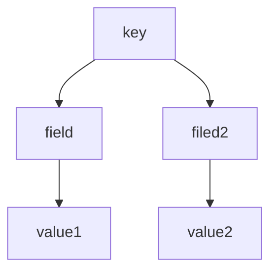

# 1 Redis 

> Remote Dictionary Server（Redis）是一个开源的使用 ANSI C 语言编写，支持网络、可基于内存也可持久化的日志性、key-value 数据库，并提供多种语言的API 。
>
> Redis 被称为数据结构服务器，主要功能是对查询信息进行内存缓存
>
> Redis is an open source (BSD licensed), in-memory data structure store, used as a database, cache and message broker. It supports data structures such as strings, hashes, lists, sets, sorted sets with range queries, bitmaps, hyperloglogs, geospatial indexes with radius queries and streams. Redis has built-in replication, Lua scripting, LRU eviction, transactions and different levels of on-disk persistence, and provides high availability via Redis Sentinel and automatic partitioning with Redis Cluster.

# 2 安装 Redis 单机版

> 安装 Redis 3.0.0  
>
> 3.0 版本表示支持集群安装
>
> 版本号中副版本号奇数表示测试版，偶数表示稳定版，在生产环境中使用

```shell
#安装 gcc
gcc install gcc-c++

#安装 redis 软件
tar -zxf redis

#进入 cd redis 根据目录
#编译
make

#安装 redis 软件，并指定安装位置
#注意 PREFIX 必须是大写
make instal PREFIX=/usr/local/redis

#进入 cd /usr/local/redis/bin
#前置启动
./redis-server


#在 redis 解压包中奖 redis.conf 拷贝到 /usr/local/redis目录下
#编辑 redis.conf 文件，将文件的中 daemonisze no 改为 yes 即可

#后端启动
./redis-server redis.conf

#查看 redis 进程状态
ps aux | grep redis

#测试 redis
#进入 /usr/local/redis/bin
#启动 redis 客户端
./redis-cli
输入 ping ---> 返回 pong

#前提使用 redis 后置启动
#关闭 redis 
#进入 /usr/local/redis/bin
./redis-cli  shutdown
```

前置启动，redis 启动后不能再输入其他命令，除了 Ctrl+C  停止 redis 服务


后置启动


# 3 Redis 的数据类型

## 3.1 String 类型

> 默认是字符序列

```shell
#设置单个键值对
set key value
#设置多个键值对
mset key1 value1 key2 value2 ...
#获取单个键的值
get key
#获取多个键的值 
mset key1 key2 key3
#删除单个键值对
del key
#删除多个键值对
flushdb

#设置字符串值的递增，每次递增为1
incr key
#设置字符串值的地址，每次递增为 num
incrby key num
```

## 3.2 Hash 类型

> hash 是键值对的集合




```shell
#设置单个
hset key field value
#设置多个
hmset key field value field2 value2
#获取单个
hget key field
#获取多个
hmget key field filed2 value2
#获取全部
hgetall key
#只全部获取值
hvals key
#删除
hdel key 
#存在，存在返回 1，否则返回 0
hexists  key  field
#元素的个数
hlen key 
```

## 3.3 List 类型

> List 类型是双链表


```shell
#在最左边添加
lpush name value   
#在最右边添加
rpush name value
#从最左边弹出
lpop name
#从最右边弹出
rpop name 
#列出指定范围内的值
#Index 可以为负数， -1 表示倒数第一个
#但是 lrange 都是从左到右额顺序查找
lrange name startIndex endIndex
#查找指定位置上的值
lindex name index
#修改指定位置上的值
lset name index value 


127.0.0.1:6379> lpush tt 1
(integer) 1
127.0.0.1:6379> lpush tt 2
(integer) 2
127.0.0.1:6379> lpush tt 3
(integer) 3
127.0.0.1:6379> rpush tt  A
(integer) 4
127.0.0.1:6379> rpush tt B
(integer) 5
127.0.0.1:6379> rpush tt C
(integer) 6
127.0.0.1:6379> lrange tt  0 4
1) "3"
2) "2"
3) "1"
4) "A"
5) "B"
127.0.0.1:6379> lpop tt
"3"
127.0.0.1:6379> lpop tt
"2"
127.0.0.1:6379> rpop tt
"C"
127.0.0.1:6379> lrange tt 0 4
1) "1"
2) "A"
3) "B"
127.0.0.1:6379> lindex tt 2
"B"
127.0.0.1:6379> lset tt 2 b
OK
127.0.0.1:6379> lindex tt 2
"b"
127.0.0.1:6379> lindex tt -1
"b"
127.0.0.1:6379> lrange tt 1 -1
1) "A"
2) "b"
```

## 3.4  Set 类型

> 字符串的无序集合
>
> 一个 key 对应多个 value ，并且 value 值的排序是无序的

```shell
#添加
sadd key value
#返回 key 对应 value 元素的个数
scard key
#列出 key 中所有的 value 值
smemebers key
#判断 key 中 value 是否存在
sismember key value
#移除指定的 key 中 value 
srem key vlaue
```

## 3.5 SortedzSet 类型

> 字符串的有序集合

```shell
#添加 key 中值
zadd key index value
#列出 key 中指定范围的 value 
zrange startIndex endIndex [withscores]
#删除指定范围内的 value 
zremrangebyscore key startIndex endIndex 
```

## 3.6 Redis 中其他命令

```
ping 测试 redis 是否连接，如果连接，则返回 pong
echo value 测试 redis 是否连接，如果连接，则返回 value
keys * 返回当前 redis 库所有 key
exists key 判断字符串是否存在
expire key time(s) 设置一个 key 的过期时间 单位秒。时间到达后，会删除key及value
ttl key 查询离失效的剩余时间，以秒为单位。未设置失效时间，返回 -1
persist key  移动给定 key 的过期时间
select dbindex  选择数据库（0-15）
move key  dbIndex 将当前数据库中移动到其他库
dbsize 返回当前数据库中 key 的数目
info 获取服务器的信息和统set per
flushdb 删除当前库中所有 key
flushall 删除所有库中的 key 
quit 退出连接
```

# 4 Redis 的配置以及持久化方案

## 4.1 redis.conf 文件

```properties
# Redis configuration file example

# Note on units: when memory size is needed, it is possible to specify
# it in the usual form of 1k 5GB 4M and so forth:
#
# 1k => 1000 bytes
# 1kb => 1024 bytes
# 1m => 1000000 bytes
# 1mb => 1024*1024 bytes
# 1g => 1000000000 bytes
# 1gb => 1024*1024*1024 bytes
#
# units are case insensitive so 1GB 1Gb 1gB are all the same.

################################## INCLUDES ###################################

# Include one or more other config files here.  This is useful if you
# have a standard template that goes to all Redis servers but also need
# to customize a few per-server settings.  Include files can include
# other files, so use this wisely.
#
# Notice option "include" won't be rewritten by command "CONFIG REWRITE"
# from admin or Redis Sentinel. Since Redis always uses the last processed
# line as value of a configuration directive, you'd better put includes
# at the beginning of this file to avoid overwriting config change at runtime.
#
# If instead you are interested in using includes to override configuration
# options, it is better to use include as the last line.
#
# include /path/to/local.conf
# include /path/to/other.conf

################################ GENERAL  #####################################

# By default Redis does not run as a daemon. Use 'yes' if you need it.
# Note that Redis will write a pid file in /var/run/redis.pid when daemonized.
#开启 redis 后置启动
daemonize yes

# When running daemonized, Redis writes a pid file in /var/run/redis.pid by
# default. You can specify a custom pid file location here.
pidfile /var/run/redis.pid

# Accept connections on the specified port, default is 6379.
# If port 0 is specified Redis will not listen on a TCP socket.
port 6379

# TCP listen() backlog.
#
# In high requests-per-second environments you need an high backlog in order
# to avoid slow clients connections issues. Note that the Linux kernel
# will silently truncate it to the value of /proc/sys/net/core/somaxconn so
# make sure to raise both the value of somaxconn and tcp_max_syn_backlog
# in order to get the desired effect.
tcp-backlog 511

# By default Redis listens for connections from all the network interfaces
# available on the server. It is possible to listen to just one or multiple
# interfaces using the "bind" configuration directive, followed by one or
# more IP addresses.
#
# Examples:
#
# bind 192.168.1.100 10.0.0.1
# bind 127.0.0.1

# Specify the path for the Unix socket that will be used to listen for
# incoming connections. There is no default, so Redis will not listen
# on a unix socket when not specified.
#
# unixsocket /tmp/redis.sock
# unixsocketperm 700

# Close the connection after a client is idle for N seconds (0 to disable)
timeout 0

# TCP keepalive.
#
# If non-zero, use SO_KEEPALIVE to send TCP ACKs to clients in absence
# of communication. This is useful for two reasons:
#
# 1) Detect dead peers.
# 2) Take the connection alive from the point of view of network
#    equipment in the middle.
#
# On Linux, the specified value (in seconds) is the period used to send ACKs.
# Note that to close the connection the double of the time is needed.
# On other kernels the period depends on the kernel configuration.
#
# A reasonable value for this option is 60 seconds.
tcp-keepalive 0

# Specify the server verbosity level.
# This can be one of:
# debug (a lot of information, useful for development/testing)
# verbose (many rarely useful info, but not a mess like the debug level)
# notice (moderately verbose, what you want in production probably)
# warning (only very important / critical messages are logged)
loglevel notice

# Specify the log file name. Also the empty string can be used to force
# Redis to log on the standard output. Note that if you use standard
# output for logging but daemonize, logs will be sent to /dev/null
logfile ""

# To enable logging to the system logger, just set 'syslog-enabled' to yes,
# and optionally update the other syslog parameters to suit your needs.
# syslog-enabled no

# Specify the syslog identity.
# syslog-ident redis

# Specify the syslog facility. Must be USER or between LOCAL0-LOCAL7.
# syslog-facility local0

# Set the number of databases. The default database is DB 0, you can select
# a different one on a per-connection basis using SELECT <dbid> where
# dbid is a number between 0 and 'databases'-1
#默认数据库的个数
databases 16

################################ SNAPSHOTTING  ################################
#
# Save the DB on disk:
#
#   save <seconds> <changes>
#
#   Will save the DB if both the given number of seconds and the given
#   number of write operations against the DB occurred.
#
#   In the example below the behaviour will be to save:
#   after 900 sec (15 min) if at least 1 key changed
#   after 300 sec (5 min) if at least 10 keys changed
#   after 60 sec if at least 10000 keys changed
#
#   Note: you can disable saving completely by commenting out all "save" lines.
#
#   It is also possible to remove all the previously configured save
#   points by adding a save directive with a single empty string argument
#   like in the following example:
#
#   save ""

save 900 1
save 300 10
save 60 10000

# By default Redis will stop accepting writes if RDB snapshots are enabled
# (at least one save point) and the latest background save failed.
# This will make the user aware (in a hard way) that data is not persisting
# on disk properly, otherwise chances are that no one will notice and some
# disaster will happen.
#
# If the background saving process will start working again Redis will
# automatically allow writes again.
#
# However if you have setup your proper monitoring of the Redis server
# and persistence, you may want to disable this feature so that Redis will
# continue to work as usual even if there are problems with disk,
# permissions, and so forth.
stop-writes-on-bgsave-error yes

# Compress string objects using LZF when dump .rdb databases?
# For default that's set to 'yes' as it's almost always a win.
# If you want to save some CPU in the saving child set it to 'no' but
# the dataset will likely be bigger if you have compressible values or keys.
rdbcompression yes

# Since version 5 of RDB a CRC64 checksum is placed at the end of the file.
# This makes the format more resistant to corruption but there is a performance
# hit to pay (around 10%) when saving and loading RDB files, so you can disable it
# for maximum performances.
#
# RDB files created with checksum disabled have a checksum of zero that will
# tell the loading code to skip the check.
rdbchecksum yes

# The filename where to dump the DB
# RDB 方式数据持久化到磁盘保存的文件名 dump.rdb
dbfilename dump.rdb

# The working directory.
#
# The DB will be written inside this directory, with the filename specified
# above using the 'dbfilename' configuration directive.
#
# The Append Only File will also be created inside this directory.
#
# Note that you must specify a directory here, not a file name.
dir ./

################################# REPLICATION #################################

# Master-Slave replication. Use slaveof to make a Redis instance a copy of
# another Redis server. A few things to understand ASAP about Redis replication.
#
# 1) Redis replication is asynchronous, but you can configure a master to
#    stop accepting writes if it appears to be not connected with at least
#    a given number of slaves.
# 2) Redis slaves are able to perform a partial resynchronization with the
#    master if the replication link is lost for a relatively small amount of
#    time. You may want to configure the replication backlog size (see the next
#    sections of this file) with a sensible value depending on your needs.
# 3) Replication is automatic and does not need user intervention. After a
#    network partition slaves automatically try to reconnect to masters
#    and resynchronize with them.
#
# slaveof <masterip> <masterport>

# If the master is password protected (using the "requirepass" configuration
# directive below) it is possible to tell the slave to authenticate before
# starting the replication synchronization process, otherwise the master will
# refuse the slave request.
#
# masterauth <master-password>

# When a slave loses its connection with the master, or when the replication
# is still in progress, the slave can act in two different ways:
#
# 1) if slave-serve-stale-data is set to 'yes' (the default) the slave will
#    still reply to client requests, possibly with out of date data, or the
#    data set may just be empty if this is the first synchronization.
#
# 2) if slave-serve-stale-data is set to 'no' the slave will reply with
#    an error "SYNC with master in progress" to all the kind of commands
#    but to INFO and SLAVEOF.
#
slave-serve-stale-data yes

# You can configure a slave instance to accept writes or not. Writing against
# a slave instance may be useful to store some ephemeral data (because data
# written on a slave will be easily deleted after resync with the master) but
# may also cause problems if clients are writing to it because of a
# misconfiguration.
#
# Since Redis 2.6 by default slaves are read-only.
#
# Note: read only slaves are not designed to be exposed to untrusted clients
# on the internet. It's just a protection layer against misuse of the instance.
# Still a read only slave exports by default all the administrative commands
# such as CONFIG, DEBUG, and so forth. To a limited extent you can improve
# security of read only slaves using 'rename-command' to shadow all the
# administrative / dangerous commands.
slave-read-only yes

# Replication SYNC strategy: disk or socket.
#
# -------------------------------------------------------
# WARNING: DISKLESS REPLICATION IS EXPERIMENTAL CURRENTLY
# -------------------------------------------------------
#
# New slaves and reconnecting slaves that are not able to continue the replication
# process just receiving differences, need to do what is called a "full
# synchronization". An RDB file is transmitted from the master to the slaves.
# The transmission can happen in two different ways:
#
# 1) Disk-backed: The Redis master creates a new process that writes the RDB
#                 file on disk. Later the file is transferred by the parent
#                 process to the slaves incrementally.
# 2) Diskless: The Redis master creates a new process that directly writes the
#              RDB file to slave sockets, without touching the disk at all.
#
# With disk-backed replication, while the RDB file is generated, more slaves
# can be queued and served with the RDB file as soon as the current child producing
# the RDB file finishes its work. With diskless replication instead once
# the transfer starts, new slaves arriving will be queued and a new transfer
# will start when the current one terminates.
#
# When diskless replication is used, the master waits a configurable amount of
# time (in seconds) before starting the transfer in the hope that multiple slaves
# will arrive and the transfer can be parallelized.
#
# With slow disks and fast (large bandwidth) networks, diskless replication
# works better.
repl-diskless-sync no

# When diskless replication is enabled, it is possible to configure the delay
# the server waits in order to spawn the child that transfers the RDB via socket
# to the slaves.
#
# This is important since once the transfer starts, it is not possible to serve
# new slaves arriving, that will be queued for the next RDB transfer, so the server
# waits a delay in order to let more slaves arrive.
#
# The delay is specified in seconds, and by default is 5 seconds. To disable
# it entirely just set it to 0 seconds and the transfer will start ASAP.
repl-diskless-sync-delay 5

# Slaves send PINGs to server in a predefined interval. It's possible to change
# this interval with the repl_ping_slave_period option. The default value is 10
# seconds.
#
# repl-ping-slave-period 10

# The following option sets the replication timeout for:
#
# 1) Bulk transfer I/O during SYNC, from the point of view of slave.
# 2) Master timeout from the point of view of slaves (data, pings).
# 3) Slave timeout from the point of view of masters (REPLCONF ACK pings).
#
# It is important to make sure that this value is greater than the value
# specified for repl-ping-slave-period otherwise a timeout will be detected
# every time there is low traffic between the master and the slave.
#
# repl-timeout 60

# Disable TCP_NODELAY on the slave socket after SYNC?
#
# If you select "yes" Redis will use a smaller number of TCP packets and
# less bandwidth to send data to slaves. But this can add a delay for
# the data to appear on the slave side, up to 40 milliseconds with
# Linux kernels using a default configuration.
#
# If you select "no" the delay for data to appear on the slave side will
# be reduced but more bandwidth will be used for replication.
#
# By default we optimize for low latency, but in very high traffic conditions
# or when the master and slaves are many hops away, turning this to "yes" may
# be a good idea.
repl-disable-tcp-nodelay no

# Set the replication backlog size. The backlog is a buffer that accumulates
# slave data when slaves are disconnected for some time, so that when a slave
# wants to reconnect again, often a full resync is not needed, but a partial
# resync is enough, just passing the portion of data the slave missed while
# disconnected.
#
# The bigger the replication backlog, the longer the time the slave can be
# disconnected and later be able to perform a partial resynchronization.
#
# The backlog is only allocated once there is at least a slave connected.
#
# repl-backlog-size 1mb

# After a master has no longer connected slaves for some time, the backlog
# will be freed. The following option configures the amount of seconds that
# need to elapse, starting from the time the last slave disconnected, for
# the backlog buffer to be freed.
#
# A value of 0 means to never release the backlog.
#
# repl-backlog-ttl 3600

# The slave priority is an integer number published by Redis in the INFO output.
# It is used by Redis Sentinel in order to select a slave to promote into a
# master if the master is no longer working correctly.
#
# A slave with a low priority number is considered better for promotion, so
# for instance if there are three slaves with priority 10, 100, 25 Sentinel will
# pick the one with priority 10, that is the lowest.
#
# However a special priority of 0 marks the slave as not able to perform the
# role of master, so a slave with priority of 0 will never be selected by
# Redis Sentinel for promotion.
#
# By default the priority is 100.
slave-priority 100

# It is possible for a master to stop accepting writes if there are less than
# N slaves connected, having a lag less or equal than M seconds.
#
# The N slaves need to be in "online" state.
#
# The lag in seconds, that must be <= the specified value, is calculated from
# the last ping received from the slave, that is usually sent every second.
#
# This option does not GUARANTEE that N replicas will accept the write, but
# will limit the window of exposure for lost writes in case not enough slaves
# are available, to the specified number of seconds.
#
# For example to require at least 3 slaves with a lag <= 10 seconds use:
#
# min-slaves-to-write 3
# min-slaves-max-lag 10
#
# Setting one or the other to 0 disables the feature.
#
# By default min-slaves-to-write is set to 0 (feature disabled) and
# min-slaves-max-lag is set to 10.

################################## SECURITY ###################################

# Require clients to issue AUTH <PASSWORD> before processing any other
# commands.  This might be useful in environments in which you do not trust
# others with access to the host running redis-server.
#
# This should stay commented out for backward compatibility and because most
# people do not need auth (e.g. they run their own servers).
#
# Warning: since Redis is pretty fast an outside user can try up to
# 150k passwords per second against a good box. This means that you should
# use a very strong password otherwise it will be very easy to break.
#
# requirepass foobared

# Command renaming.
#
# It is possible to change the name of dangerous commands in a shared
# environment. For instance the CONFIG command may be renamed into something
# hard to guess so that it will still be available for internal-use tools
# but not available for general clients.
#
# Example:
#
# rename-command CONFIG b840fc02d524045429941cc15f59e41cb7be6c52
#
# It is also possible to completely kill a command by renaming it into
# an empty string:
#
# rename-command CONFIG ""
#
# Please note that changing the name of commands that are logged into the
# AOF file or transmitted to slaves may cause problems.

################################### LIMITS ####################################

# Set the max number of connected clients at the same time. By default
# this limit is set to 10000 clients, however if the Redis server is not
# able to configure the process file limit to allow for the specified limit
# the max number of allowed clients is set to the current file limit
# minus 32 (as Redis reserves a few file descriptors for internal uses).
#
# Once the limit is reached Redis will close all the new connections sending
# an error 'max number of clients reached'.
#
# maxclients 10000

# Don't use more memory than the specified amount of bytes.
# When the memory limit is reached Redis will try to remove keys
# according to the eviction policy selected (see maxmemory-policy).
#
# If Redis can't remove keys according to the policy, or if the policy is
# set to 'noeviction', Redis will start to reply with errors to commands
# that would use more memory, like SET, LPUSH, and so on, and will continue
# to reply to read-only commands like GET.
#
# This option is usually useful when using Redis as an LRU cache, or to set
# a hard memory limit for an instance (using the 'noeviction' policy).
#
# WARNING: If you have slaves attached to an instance with maxmemory on,
# the size of the output buffers needed to feed the slaves are subtracted
# from the used memory count, so that network problems / resyncs will
# not trigger a loop where keys are evicted, and in turn the output
# buffer of slaves is full with DELs of keys evicted triggering the deletion
# of more keys, and so forth until the database is completely emptied.
#
# In short... if you have slaves attached it is suggested that you set a lower
# limit for maxmemory so that there is some free RAM on the system for slave
# output buffers (but this is not needed if the policy is 'noeviction').
#
# maxmemory <bytes>

# MAXMEMORY POLICY: how Redis will select what to remove when maxmemory
# is reached. You can select among five behaviors:
#
# volatile-lru -> remove the key with an expire set using an LRU algorithm
# allkeys-lru -> remove any key according to the LRU algorithm
# volatile-random -> remove a random key with an expire set
# allkeys-random -> remove a random key, any key
# volatile-ttl -> remove the key with the nearest expire time (minor TTL)
# noeviction -> don't expire at all, just return an error on write operations
#
# Note: with any of the above policies, Redis will return an error on write
#       operations, when there are no suitable keys for eviction.
#
#       At the date of writing these commands are: set setnx setex append
#       incr decr rpush lpush rpushx lpushx linsert lset rpoplpush sadd
#       sinter sinterstore sunion sunionstore sdiff sdiffstore zadd zincrby
#       zunionstore zinterstore hset hsetnx hmset hincrby incrby decrby
#       getset mset msetnx exec sort
#
# The default is:
#
# maxmemory-policy noeviction

# LRU and minimal TTL algorithms are not precise algorithms but approximated
# algorithms (in order to save memory), so you can tune it for speed or
# accuracy. For default Redis will check five keys and pick the one that was
# used less recently, you can change the sample size using the following
# configuration directive.
#
# The default of 5 produces good enough results. 10 Approximates very closely
# true LRU but costs a bit more CPU. 3 is very fast but not very accurate.
#
# maxmemory-samples 5

############################## APPEND ONLY MODE ###############################

# By default Redis asynchronously dumps the dataset on disk. This mode is
# good enough in many applications, but an issue with the Redis process or
# a power outage may result into a few minutes of writes lost (depending on
# the configured save points).
#
# The Append Only File is an alternative persistence mode that provides
# much better durability. For instance using the default data fsync policy
# (see later in the config file) Redis can lose just one second of writes in a
# dramatic event like a server power outage, or a single write if something
# wrong with the Redis process itself happens, but the operating system is
# still running correctly.
#
# AOF and RDB persistence can be enabled at the same time without problems.
# If the AOF is enabled on startup Redis will load the AOF, that is the file
# with the better durability guarantees.
#
# Please check http://redis.io/topics/persistence for more information.

appendonly no

# The name of the append only file (default: "appendonly.aof")

appendfilename "appendonly.aof"

# The fsync() call tells the Operating System to actually write data on disk
# instead of waiting for more data in the output buffer. Some OS will really flush
# data on disk, some other OS will just try to do it ASAP.
#
# Redis supports three different modes:
#
# no: don't fsync, just let the OS flush the data when it wants. Faster.
# always: fsync after every write to the append only log. Slow, Safest.
# everysec: fsync only one time every second. Compromise.
#
# The default is "everysec", as that's usually the right compromise between
# speed and data safety. It's up to you to understand if you can relax this to
# "no" that will let the operating system flush the output buffer when
# it wants, for better performances (but if you can live with the idea of
# some data loss consider the default persistence mode that's snapshotting),
# or on the contrary, use "always" that's very slow but a bit safer than
# everysec.
#
# More details please check the following article:
# http://antirez.com/post/redis-persistence-demystified.html
#
# If unsure, use "everysec".

# appendfsync always
appendfsync everysec
# appendfsync no

# When the AOF fsync policy is set to always or everysec, and a background
# saving process (a background save or AOF log background rewriting) is
# performing a lot of I/O against the disk, in some Linux configurations
# Redis may block too long on the fsync() call. Note that there is no fix for
# this currently, as even performing fsync in a different thread will block
# our synchronous write(2) call.
#
# In order to mitigate this problem it's possible to use the following option
# that will prevent fsync() from being called in the main process while a
# BGSAVE or BGREWRITEAOF is in progress.
#
# This means that while another child is saving, the durability of Redis is
# the same as "appendfsync none". In practical terms, this means that it is
# possible to lose up to 30 seconds of log in the worst scenario (with the
# default Linux settings).
#
# If you have latency problems turn this to "yes". Otherwise leave it as
# "no" that is the safest pick from the point of view of durability.

no-appendfsync-on-rewrite no

# Automatic rewrite of the append only file.
# Redis is able to automatically rewrite the log file implicitly calling
# BGREWRITEAOF when the AOF log size grows by the specified percentage.
#
# This is how it works: Redis remembers the size of the AOF file after the
# latest rewrite (if no rewrite has happened since the restart, the size of
# the AOF at startup is used).
#
# This base size is compared to the current size. If the current size is
# bigger than the specified percentage, the rewrite is triggered. Also
# you need to specify a minimal size for the AOF file to be rewritten, this
# is useful to avoid rewriting the AOF file even if the percentage increase
# is reached but it is still pretty small.
#
# Specify a percentage of zero in order to disable the automatic AOF
# rewrite feature.

auto-aof-rewrite-percentage 100
auto-aof-rewrite-min-size 64mb

# An AOF file may be found to be truncated at the end during the Redis
# startup process, when the AOF data gets loaded back into memory.
# This may happen when the system where Redis is running
# crashes, especially when an ext4 filesystem is mounted without the
# data=ordered option (however this can't happen when Redis itself
# crashes or aborts but the operating system still works correctly).
#
# Redis can either exit with an error when this happens, or load as much
# data as possible (the default now) and start if the AOF file is found
# to be truncated at the end. The following option controls this behavior.
#
# If aof-load-truncated is set to yes, a truncated AOF file is loaded and
# the Redis server starts emitting a log to inform the user of the event.
# Otherwise if the option is set to no, the server aborts with an error
# and refuses to start. When the option is set to no, the user requires
# to fix the AOF file using the "redis-check-aof" utility before to restart
# the server.
#
# Note that if the AOF file will be found to be corrupted in the middle
# the server will still exit with an error. This option only applies when
# Redis will try to read more data from the AOF file but not enough bytes
# will be found.
aof-load-truncated yes

################################ LUA SCRIPTING  ###############################

# Max execution time of a Lua script in milliseconds.
#
# If the maximum execution time is reached Redis will log that a script is
# still in execution after the maximum allowed time and will start to
# reply to queries with an error.
#
# When a long running script exceeds the maximum execution time only the
# SCRIPT KILL and SHUTDOWN NOSAVE commands are available. The first can be
# used to stop a script that did not yet called write commands. The second
# is the only way to shut down the server in the case a write command was
# already issued by the script but the user doesn't want to wait for the natural
# termination of the script.
#
# Set it to 0 or a negative value for unlimited execution without warnings.
lua-time-limit 5000

################################ REDIS CLUSTER  ###############################
#
# ++++++++++++++++++++++++++++++++++++++++++++++++++++++++++++++++++++++++++++
# WARNING EXPERIMENTAL: Redis Cluster is considered to be stable code, however
# in order to mark it as "mature" we need to wait for a non trivial percentage
# of users to deploy it in production.
# ++++++++++++++++++++++++++++++++++++++++++++++++++++++++++++++++++++++++++++
#
# Normal Redis instances can't be part of a Redis Cluster; only nodes that are
# started as cluster nodes can. In order to start a Redis instance as a
# cluster node enable the cluster support uncommenting the following:
#
# cluster-enabled yes

# Every cluster node has a cluster configuration file. This file is not
# intended to be edited by hand. It is created and updated by Redis nodes.
# Every Redis Cluster node requires a different cluster configuration file.
# Make sure that instances running in the same system do not have
# overlapping cluster configuration file names.
#
# cluster-config-file nodes-6379.conf

# Cluster node timeout is the amount of milliseconds a node must be unreachable
# for it to be considered in failure state.
# Most other internal time limits are multiple of the node timeout.
#
# cluster-node-timeout 15000

# A slave of a failing master will avoid to start a failover if its data
# looks too old.
#
# There is no simple way for a slave to actually have a exact measure of
# its "data age", so the following two checks are performed:
#
# 1) If there are multiple slaves able to failover, they exchange messages
#    in order to try to give an advantage to the slave with the best
#    replication offset (more data from the master processed).
#    Slaves will try to get their rank by offset, and apply to the start
#    of the failover a delay proportional to their rank.
#
# 2) Every single slave computes the time of the last interaction with
#    its master. This can be the last ping or command received (if the master
#    is still in the "connected" state), or the time that elapsed since the
#    disconnection with the master (if the replication link is currently down).
#    If the last interaction is too old, the slave will not try to failover
#    at all.
#
# The point "2" can be tuned by user. Specifically a slave will not perform
# the failover if, since the last interaction with the master, the time
# elapsed is greater than:
#
#   (node-timeout * slave-validity-factor) + repl-ping-slave-period
#
# So for example if node-timeout is 30 seconds, and the slave-validity-factor
# is 10, and assuming a default repl-ping-slave-period of 10 seconds, the
# slave will not try to failover if it was not able to talk with the master
# for longer than 310 seconds.
#
# A large slave-validity-factor may allow slaves with too old data to failover
# a master, while a too small value may prevent the cluster from being able to
# elect a slave at all.
#
# For maximum availability, it is possible to set the slave-validity-factor
# to a value of 0, which means, that slaves will always try to failover the
# master regardless of the last time they interacted with the master.
# (However they'll always try to apply a delay proportional to their
# offset rank).
#
# Zero is the only value able to guarantee that when all the partitions heal
# the cluster will always be able to continue.
#
# cluster-slave-validity-factor 10

# Cluster slaves are able to migrate to orphaned masters, that are masters
# that are left without working slaves. This improves the cluster ability
# to resist to failures as otherwise an orphaned master can't be failed over
# in case of failure if it has no working slaves.
#
# Slaves migrate to orphaned masters only if there are still at least a
# given number of other working slaves for their old master. This number
# is the "migration barrier". A migration barrier of 1 means that a slave
# will migrate only if there is at least 1 other working slave for its master
# and so forth. It usually reflects the number of slaves you want for every
# master in your cluster.
#
# Default is 1 (slaves migrate only if their masters remain with at least
# one slave). To disable migration just set it to a very large value.
# A value of 0 can be set but is useful only for debugging and dangerous
# in production.
#
# cluster-migration-barrier 1

# By default Redis Cluster nodes stop accepting queries if they detect there
# is at least an hash slot uncovered (no available node is serving it).
# This way if the cluster is partially down (for example a range of hash slots
# are no longer covered) all the cluster becomes, eventually, unavailable.
# It automatically returns available as soon as all the slots are covered again.
#
# However sometimes you want the subset of the cluster which is working,
# to continue to accept queries for the part of the key space that is still
# covered. In order to do so, just set the cluster-require-full-coverage
# option to no.
#
# cluster-require-full-coverage yes

# In order to setup your cluster make sure to read the documentation
# available at http://redis.io web site.

################################## SLOW LOG ###################################

# The Redis Slow Log is a system to log queries that exceeded a specified
# execution time. The execution time does not include the I/O operations
# like talking with the client, sending the reply and so forth,
# but just the time needed to actually execute the command (this is the only
# stage of command execution where the thread is blocked and can not serve
# other requests in the meantime).
#
# You can configure the slow log with two parameters: one tells Redis
# what is the execution time, in microseconds, to exceed in order for the
# command to get logged, and the other parameter is the length of the
# slow log. When a new command is logged the oldest one is removed from the
# queue of logged commands.

# The following time is expressed in microseconds, so 1000000 is equivalent
# to one second. Note that a negative number disables the slow log, while
# a value of zero forces the logging of every command.
slowlog-log-slower-than 10000

# There is no limit to this length. Just be aware that it will consume memory.
# You can reclaim memory used by the slow log with SLOWLOG RESET.
slowlog-max-len 128

################################ LATENCY MONITOR ##############################

# The Redis latency monitoring subsystem samples different operations
# at runtime in order to collect data related to possible sources of
# latency of a Redis instance.
#
# Via the LATENCY command this information is available to the user that can
# print graphs and obtain reports.
#
# The system only logs operations that were performed in a time equal or
# greater than the amount of milliseconds specified via the
# latency-monitor-threshold configuration directive. When its value is set
# to zero, the latency monitor is turned off.
#
# By default latency monitoring is disabled since it is mostly not needed
# if you don't have latency issues, and collecting data has a performance
# impact, that while very small, can be measured under big load. Latency
# monitoring can easily be enabled at runtime using the command
# "CONFIG SET latency-monitor-threshold <milliseconds>" if needed.
latency-monitor-threshold 0

############################# EVENT NOTIFICATION ##############################

# Redis can notify Pub/Sub clients about events happening in the key space.
# This feature is documented at http://redis.io/topics/notifications
#
# For instance if keyspace events notification is enabled, and a client
# performs a DEL operation on key "foo" stored in the Database 0, two
# messages will be published via Pub/Sub:
#
# PUBLISH __keyspace@0__:foo del
# PUBLISH __keyevent@0__:del foo
#
# It is possible to select the events that Redis will notify among a set
# of classes. Every class is identified by a single character:
#
#  K     Keyspace events, published with __keyspace@<db>__ prefix.
#  E     Keyevent events, published with __keyevent@<db>__ prefix.
#  g     Generic commands (non-type specific) like DEL, EXPIRE, RENAME, ...
#  $     String commands
#  l     List commands
#  s     Set commands
#  h     Hash commands
#  z     Sorted set commands
#  x     Expired events (events generated every time a key expires)
#  e     Evicted events (events generated when a key is evicted for maxmemory)
#  A     Alias for g$lshzxe, so that the "AKE" string means all the events.
#
#  The "notify-keyspace-events" takes as argument a string that is composed
#  of zero or multiple characters. The empty string means that notifications
#  are disabled.
#
#  Example: to enable list and generic events, from the point of view of the
#           event name, use:
#
#  notify-keyspace-events Elg
#
#  Example 2: to get the stream of the expired keys subscribing to channel
#             name __keyevent@0__:expired use:
#
#  notify-keyspace-events Ex
#
#  By default all notifications are disabled because most users don't need
#  this feature and the feature has some overhead. Note that if you don't
#  specify at least one of K or E, no events will be delivered.
notify-keyspace-events ""

############################### ADVANCED CONFIG ###############################

# Hashes are encoded using a memory efficient data structure when they have a
# small number of entries, and the biggest entry does not exceed a given
# threshold. These thresholds can be configured using the following directives.
hash-max-ziplist-entries 512
hash-max-ziplist-value 64

# Similarly to hashes, small lists are also encoded in a special way in order
# to save a lot of space. The special representation is only used when
# you are under the following limits:
list-max-ziplist-entries 512
list-max-ziplist-value 64

# Sets have a special encoding in just one case: when a set is composed
# of just strings that happen to be integers in radix 10 in the range
# of 64 bit signed integers.
# The following configuration setting sets the limit in the size of the
# set in order to use this special memory saving encoding.
set-max-intset-entries 512

# Similarly to hashes and lists, sorted sets are also specially encoded in
# order to save a lot of space. This encoding is only used when the length and
# elements of a sorted set are below the following limits:
zset-max-ziplist-entries 128
zset-max-ziplist-value 64

# HyperLogLog sparse representation bytes limit. The limit includes the
# 16 bytes header. When an HyperLogLog using the sparse representation crosses
# this limit, it is converted into the dense representation.
#
# A value greater than 16000 is totally useless, since at that point the
# dense representation is more memory efficient.
#
# The suggested value is ~ 3000 in order to have the benefits of
# the space efficient encoding without slowing down too much PFADD,
# which is O(N) with the sparse encoding. The value can be raised to
# ~ 10000 when CPU is not a concern, but space is, and the data set is
# composed of many HyperLogLogs with cardinality in the 0 - 15000 range.
hll-sparse-max-bytes 3000

# Active rehashing uses 1 millisecond every 100 milliseconds of CPU time in
# order to help rehashing the main Redis hash table (the one mapping top-level
# keys to values). The hash table implementation Redis uses (see dict.c)
# performs a lazy rehashing: the more operation you run into a hash table
# that is rehashing, the more rehashing "steps" are performed, so if the
# server is idle the rehashing is never complete and some more memory is used
# by the hash table.
#
# The default is to use this millisecond 10 times every second in order to
# actively rehash the main dictionaries, freeing memory when possible.
#
# If unsure:
# use "activerehashing no" if you have hard latency requirements and it is
# not a good thing in your environment that Redis can reply from time to time
# to queries with 2 milliseconds delay.
#
# use "activerehashing yes" if you don't have such hard requirements but
# want to free memory asap when possible.
activerehashing yes

# The client output buffer limits can be used to force disconnection of clients
# that are not reading data from the server fast enough for some reason (a
# common reason is that a Pub/Sub client can't consume messages as fast as the
# publisher can produce them).
#
# The limit can be set differently for the three different classes of clients:
#
# normal -> normal clients including MONITOR clients
# slave  -> slave clients
# pubsub -> clients subscribed to at least one pubsub channel or pattern
#
# The syntax of every client-output-buffer-limit directive is the following:
#
# client-output-buffer-limit <class> <hard limit> <soft limit> <soft seconds>
#
# A client is immediately disconnected once the hard limit is reached, or if
# the soft limit is reached and remains reached for the specified number of
# seconds (continuously).
# So for instance if the hard limit is 32 megabytes and the soft limit is
# 16 megabytes / 10 seconds, the client will get disconnected immediately
# if the size of the output buffers reach 32 megabytes, but will also get
# disconnected if the client reaches 16 megabytes and continuously overcomes
# the limit for 10 seconds.
#
# By default normal clients are not limited because they don't receive data
# without asking (in a push way), but just after a request, so only
# asynchronous clients may create a scenario where data is requested faster
# than it can read.
#
# Instead there is a default limit for pubsub and slave clients, since
# subscribers and slaves receive data in a push fashion.
#
# Both the hard or the soft limit can be disabled by setting them to zero.
client-output-buffer-limit normal 0 0 0
client-output-buffer-limit slave 256mb 64mb 60
client-output-buffer-limit pubsub 32mb 8mb 60

# Redis calls an internal function to perform many background tasks, like
# closing connections of clients in timeout, purging expired keys that are
# never requested, and so forth.
#
# Not all tasks are performed with the same frequency, but Redis checks for
# tasks to perform according to the specified "hz" value.
#
# By default "hz" is set to 10. Raising the value will use more CPU when
# Redis is idle, but at the same time will make Redis more responsive when
# there are many keys expiring at the same time, and timeouts may be
# handled with more precision.
#
# The range is between 1 and 500, however a value over 100 is usually not
# a good idea. Most users should use the default of 10 and raise this up to
# 100 only in environments where very low latency is required.
hz 10

# When a child rewrites the AOF file, if the following option is enabled
# the file will be fsync-ed every 32 MB of data generated. This is useful
# in order to commit the file to the disk more incrementally and avoid
# big latency spikes.
aof-rewrite-incremental-fsync yes

```

## 4.2 Redis的数据持久化

### 4.1 RDB 方式

将内存中的数据持久化到磁盘中保存

| 命令   | 功能                                                         |
| ------ | ------------------------------------------------------------ |
| save   | 将数据保存到磁盘中，但会阻塞 redis 进程，不能再执行其他操作  |
| bgsave | 将数据保存到磁盘中，会创建一个新的子进程，但是不能在执行 bgsave 命令再执行备份命令（save或 bgsave） |

注意：保存到磁盘中的位置取决于当前进入 redis 客户端的位置。

### 4.2 AOF 方式

通过保存 redis 服务器所执**行的写命令来记录数据库状态的文件**

```properties
#开启 AOF 方法
appendonly yes 
#默认推荐每秒刷新
appendfsync everysec
```

# 5 Redis 集群

## 5.1 理论

## 5.2 搭建

```shell
#安装 ruby 环境
yum install ruby
#安装 ruby 的包管理器
yum install rubygems
# 安装 ruby 包
# ruby 包的位置在 redis 的安装目录下的 src 目录下 redis-trib.rb
gem install redis3.0.0
# 进入 /usr/local
mkdir redis-cluster
#复制 1个 安装好的 redis 软件
#修改 redis.conf 配置文件
#复制 其余 5个 redis 软件
#将 ruby 脚本 redis-trib.rb
#创建集群
./redis-trib.rb create --replicas 1  192.168.170.4:7001 192.168.170.4:7002 192.168.170.4:7003 192.168.170.4:7004 192.168.170.4:7005 192.168.170.4:7006 	
#创建开启 redis 集群
#创建关闭 redis 集群
```


# 6  使用 JedisAPI 操作 Redis 

Jedis 继承了 redis 的一些命令操作，封装了对 redis 命令的 Java 客户端

## 1 用 Jedis 操作 Redis 单机版

使用 maven 创建 jar 项目

调用 jedis 的 API完成对 Redis 的操作。

在 Jedis 中方法的命名与操作 Redis 的命令相同

```java
public static void testJedisDemo(){

    //创建一个 Jedis 对象
    Jedis jedis = new Jedis("192.168.170.4",6379);
    //调用 Jedis API 对象，注意  Jedis 对象的方法与 redis 客户端中的方法名相同
    String result = jedis.set("key","Hello World");
    System.out.println(result);
    String str = jedis.get("key");
    System.out.println(str);

    System.out.println("--------");
    Long res = jedis.hset("user", "name", "wrx");
    System.out.println(res);
    String h = jedis.hget("user", "name");
    System.out.println(h);
    //关闭 jedis 连接
    jedis.close();
}
```

## 2 使用 Jedis 连接池 Pool

> 类似于数据连接池

```java

public static void testJedisPool(){
    //创建 Jedis 连接池
    JedisPool pool = new JedisPool("192.168.170.4", 6379);
    //获取 Jedis 连接对象
    Jedis jedis = pool.getResource();
    //获取 hash 
    String name = jedis.hget("user","name");
    System.out.println(name);
    //关闭 jedis 连接
    jedis.close();
}
```


## 3用 Jedis 操作 Redis 集群

```java
public static void testJediscluster(){
		Set<HostAndPort> nodes = new HashSet<>();
		nodes.add(new HostAndPort("192.168.170.4", 7001));
		nodes.add(new HostAndPort("192.168.170.4", 7002));
		nodes.add(new HostAndPort("192.168.170.4", 7003));
		nodes.add(new HostAndPort("192.168.170.4", 7004));
		nodes.add(new HostAndPort("192.168.170.4", 7005));
		nodes.add(new HostAndPort("192.168.170.4", 7006));
		//连接 redis 集群
		JedisCluster cluster = new JedisCluster(nodes);
		//操作 redis 集群
		cluster.set("user", "name11");
		String user = cluster.get("user");
		System.out.println(user);
		//关闭 redis 集群连接
		try {
			cluster.close();
		} catch (IOException e) {
			e.printStackTrace();
		}
	}
```


# 7  spring 整合 Jedis 单机版

创建 Maven 中 jar 项目，修改 pom.xml 文件，添加 jedis 和 spring 依赖

## 7.1  dao 接口

```javascript
package com.szxy.dao;

/**
 * 接口
 *
 */
public interface JedisDao {
	
	public String set(String key,String value);
	public String get(String key);
	public long hset(String hkey,String key,String value);
	public String hget(String hkey,String key);
	
}

```

## 7.2  impl 实现类

```java
package com.szxy.dao.impl;

import org.springframework.beans.factory.annotation.Autowired;

import com.szxy.dao.JedisDao;

import redis.clients.jedis.Jedis;
import redis.clients.jedis.JedisPool;

public class JedisDaoImplSigle implements JedisDao{

	@Autowired
	private JedisPool jedisPool;
	
	@Override
	public String set(String key, String value) {
		Jedis jedis = this.jedisPool.getResource();
		return jedis.set(key, value);
	}

	@Override
	public String get(String key) {
		Jedis jedis = this.jedisPool.getResource();
		return jedis.get(key);
	}

	@Override
	public long hset(String hkey, String key, String value) {
		Jedis jedis = this.jedisPool.getResource();
		return jedis.hset(hkey, key, value);
	}

	@Override
	public String hget(String hkey, String key) {
		Jedis jedis = this.jedisPool.getResource();
		return jedis.hget(hkey, key);
	}

}

```

## 7.3 applicationContext-jredis.xml

```xml
<?xml version="1.0" encoding="UTF-8"?>
<beans xmlns="http://www.springframework.org/schema/beans"
	xmlns:xsi="http://www.w3.org/2001/XMLSchema-instance" xmlns:p="http://www.springframework.org/schema/p"
	xmlns:context="http://www.springframework.org/schema/context"
	xmlns:mvc="http://www.springframework.org/schema/mvc"
	xsi:schemaLocation="http://www.springframework.org/schema/beans http://www.springframework.org/schema/beans/spring-beans.xsd
        http://www.springframework.org/schema/mvc http://www.springframework.org/schema/mvc/spring-mvc-4.0.xsd
        http://www.springframework.org/schema/context http://www.springframework.org/schema/context/spring-context.xsd">

	<!-- 开启组件扫描 -->
	<context:component-scan base-package="com.szxy" />
	<!-- jedisPool的配置 -->
	<bean id="poolconfig" class="redis.clients.jedis.JedisPoolConfig">
		<!-- 最大连接数 -->
		<property name="maxTotal" value="30" />
		<!-- 最大空闲连接数 -->
		<property name="maxIdle" value="10" />
		<!-- 每次释放连接的最大数目 -->
		<property name="numTestsPerEvictionRun" value="1024" />
		<!-- 释放连接的扫描间隔（毫秒） -->
		<property name="timeBetweenEvictionRunsMillis" value="30000" />
		<!-- 连接最小空闲时间 -->
		<property name="minEvictableIdleTimeMillis" value="1800000" />
		<!-- 连接空闲多久后释放, 当空闲时间>该值 且 空闲连接>最大空闲连接数 时直接释放 -->
		<property name="softMinEvictableIdleTimeMillis" value="10000" />
		<!-- 获取连接时的最大等待毫秒数,小于零:阻塞不确定的时间,默认-1 -->
		<property name="maxWaitMillis" value="1500" />
		<!-- 在获取连接的时候检查有效性, 默认false -->
		<property name="testOnBorrow" value="true" />
		<!-- 在空闲时检查有效性, 默认false -->
		<property name="testWhileIdle" value="true" />
		<!-- 连接耗尽时是否阻塞, false报异常,ture阻塞直到超时, 默认true -->
		<property name="blockWhenExhausted" value="false" />
	</bean>

	<bean id="jedisPool" class="redis.clients.jedis.JedisPool">
		<!-- 构造注入 -->
		<constructor-arg name="host">
			<value>192.168.170.4</value>
		</constructor-arg>
		<constructor-arg name="port">
			<value>6379</value>
		</constructor-arg>
		<constructor-arg name="poolConfig">
			<ref bean="poolconfig" />
		</constructor-arg>
	</bean>

	<bean id="JedisDaoImplSigle" class="com.szxy.dao.impl.JedisDaoImplSigle" />


</beans>
```

## 7.4 测试

```java
package com.szxy.dao.impl;

import org.springframework.beans.factory.annotation.Autowired;

import com.szxy.dao.JedisDao;

import redis.clients.jedis.Jedis;
import redis.clients.jedis.JedisPool;

public class JedisDaoImplSigle implements JedisDao{

	@Autowired
	private JedisPool jedisPool;
	
	@Override
	public String set(String key, String value) {
		Jedis jedis = this.jedisPool.getResource();
		return jedis.set(key, value);
	}

	@Override
	public String get(String key) {
		Jedis jedis = this.jedisPool.getResource();
		return jedis.get(key);
	}

	@Override
	public long hset(String hkey, String key, String value) {
		Jedis jedis = this.jedisPool.getResource();
		return jedis.hset(hkey, key, value);
	}

	@Override
	public String hget(String hkey, String key) {
		Jedis jedis = this.jedisPool.getResource();
		return jedis.hget(hkey, key);
	}

}

```

# 8 spring 整合 redis 集群版

##  8.1  impl 实现类

```java
package com.szxy.dao.impl;

import org.springframework.beans.factory.annotation.Autowired;

import com.szxy.dao.JedisDao;

import redis.clients.jedis.HostAndPort;
import redis.clients.jedis.JedisCluster;
/**
 *  
 * 集群版 
 */
public class JedisDaoImplCluter implements JedisDao{

	@Autowired
	private JedisCluster jedisCluster;
	
	
	@Override
	public String set(String key, String value) {
		//new JedisCluster(nodes, poolConfig)
		//HostAndPort hostAndPort = new HostAndPort(host, port);
		return this.jedisCluster.set(key, value);
	}

	@Override
	public String get(String key) {
		return this.jedisCluster.get(key);
	}

	@Override
	public long hset(String hkey, String key, String value) {
		return this.jedisCluster.hset(hkey, key, value);
	}

	@Override
	public String hget(String hkey, String key) {
		return this.jedisCluster.hget(hkey, key);
	}

}

```

## 8.2  applicationContext-jedis-cluster.xml

```xml
<?xml version="1.0" encoding="UTF-8"?>
<beans xmlns="http://www.springframework.org/schema/beans"
	xmlns:xsi="http://www.w3.org/2001/XMLSchema-instance" xmlns:p="http://www.springframework.org/schema/p"
	xmlns:context="http://www.springframework.org/schema/context"
	xmlns:mvc="http://www.springframework.org/schema/mvc"
	xsi:schemaLocation="http://www.springframework.org/schema/beans http://www.springframework.org/schema/beans/spring-beans.xsd
        http://www.springframework.org/schema/mvc http://www.springframework.org/schema/mvc/spring-mvc-4.0.xsd
        http://www.springframework.org/schema/context http://www.springframework.org/schema/context/spring-context.xsd">

	<!-- 开启组件扫描 -->
	<context:component-scan base-package="com.szxy" />
	<!-- jedisPool的配置 -->
	<bean id="poolconfig" class="redis.clients.jedis.JedisPoolConfig">
		<!-- 最大连接数 -->
		<property name="maxTotal" value="30" />
		<!-- 最大空闲连接数 -->
		<property name="maxIdle" value="10" />
		<!-- 每次释放连接的最大数目 -->
		<property name="numTestsPerEvictionRun" value="1024" />
		<!-- 释放连接的扫描间隔（毫秒） -->
		<property name="timeBetweenEvictionRunsMillis" value="30000" />
		<!-- 连接最小空闲时间 -->
		<property name="minEvictableIdleTimeMillis" value="1800000" />
		<!-- 连接空闲多久后释放, 当空闲时间>该值 且 空闲连接>最大空闲连接数 时直接释放 -->
		<property name="softMinEvictableIdleTimeMillis" value="10000" />
		<!-- 获取连接时的最大等待毫秒数,小于零:阻塞不确定的时间,默认-1 -->
		<property name="maxWaitMillis" value="1500" />
		<!-- 在获取连接的时候检查有效性, 默认false -->
		<property name="testOnBorrow" value="true" />
		<!-- 在空闲时检查有效性, 默认false -->
		<property name="testWhileIdle" value="true" />
		<!-- 连接耗尽时是否阻塞, false报异常,ture阻塞直到超时, 默认true -->
		<property name="blockWhenExhausted" value="false" />
	</bean>
	
	<!-- Jedis 操作 redis 集群 -->
	<bean id="jedisCluster" class="redis.clients.jedis.JedisCluster">
		<constructor-arg name="nodes">
			<set>
				<bean class="redis.clients.jedis.HostAndPort">
					<constructor-arg name="host">
						<value>192.168.170.4</value>
					</constructor-arg>
					<constructor-arg name="port">
						<value>7001</value>
					</constructor-arg>
				</bean>
				<bean class="redis.clients.jedis.HostAndPort">
					<constructor-arg name="host">
						<value>192.168.170.4</value>
					</constructor-arg>
					<constructor-arg name="port">
						<value>7002</value>
					</constructor-arg>
				</bean>
				<bean class="redis.clients.jedis.HostAndPort">
					<constructor-arg name="host">
						<value>192.168.170.4</value>
					</constructor-arg>
					<constructor-arg name="port">
						<value>7003</value>
					</constructor-arg>
				</bean>
				<bean class="redis.clients.jedis.HostAndPort">
					<constructor-arg name="host">
						<value>192.168.170.4</value>
					</constructor-arg>
					<constructor-arg name="port">
						<value>7004</value>
					</constructor-arg>
				</bean>
				<bean class="redis.clients.jedis.HostAndPort">
					<constructor-arg name="host">
						<value>192.168.170.4</value>
					</constructor-arg>
					<constructor-arg name="port">
						<value>7005</value>
					</constructor-arg>
				</bean>
				<bean class="redis.clients.jedis.HostAndPort">
					<constructor-arg name="host">
						<value>192.168.170.4</value>
					</constructor-arg>
					<constructor-arg name="port">
						<value>7006</value>
					</constructor-arg>
				</bean>
			</set>
		</constructor-arg>
		<constructor-arg name="poolConfig">
			<ref bean="poolconfig"/>
		</constructor-arg>
	</bean>
	
	<!-- 集群版 -->
	<bean id="jedisDaoImplCluter" class="com.szxy.dao.impl.JedisDaoImplCluter" />
	
</beans>
```

## 8.3  测试

```java
package com.szxy;

import org.springframework.context.support.ClassPathXmlApplicationContext;

import com.szxy.dao.JedisDao;

public class TestJedis {
	public static void main(String[] args) {
		TestJedis.testJedisCluster();
	}
	
	public static void testJedisCluster(){
		
		ClassPathXmlApplicationContext ac = new ClassPathXmlApplicationContext("applicationContext-jedis-cluster.xml");
		JedisDao dao = ac.getBean("jedisDaoImplCluter",JedisDao.class);
		String result = dao.set("szxy", "Hello World");
		System.out.println(result);
		String hello = dao.get("szxy");
		System.out.println(hello);
	}
}
```

# 9  Redis Desktop Manager 的使用

创建与 Redis 的连接

本机无法打开，闪退。。。


# 10  Redis 实战项目

## 1 需求

实现用户添加功能

实现用户查询功能，并使用 Redis 作为查询缓存

实现用户更新更新，同步缓存

## 2 技术选型

Spring+SpringMVC+Mybatis+Maven+Redis

## 3 项目搭建

### JedisDao

```java
package com.szxy.jedisdao;

/**
 * 接口
 *
 */
public interface JedisDao {
	
	/**
	 * 设置 String 类型的 key 和 value
	 * @param key
	 * @param value
	 * @return
	 */
	public String set(String key,String value);
	
	/**
	 * 获取 String 类型的 key 对应的 value
	 * @param key
	 * @return
	 */
	public String get(String key);
	
	/**
	 * 设置 hash 类型的 hkey 中 key 和value
	 * @param hkey
	 * @param key
	 * @param value
	 * @return
	 */
	public long hset(String hkey,String key,String value);
	
	/**
	 * 获取 hash 类型的hkey 中 key 对应的 value
	 * @param hkey
	 * @param key
	 * @return
	 */
	public String hget(String hkey,String key);
	
	/**
	 * 设置 key 的失效时间
	 * @param key 指定的 key 
	 * @param sec 失效时间，以秒为单位
	 * @return
	 */
	public long expire(String key,int sec);
	
	/**
	 * 删除 key 
	 * @param key
	 * @return
	 */
	public long del(String key);
	
}
```

### JedisDaoImplSingle

```java
package com.szxy.jedisdao.iml;

import org.springframework.beans.factory.annotation.Autowired;

import com.szxy.jedisdao.JedisDao;

import redis.clients.jedis.Jedis;
import redis.clients.jedis.JedisPool;
/**
 * jedis 操作 redis 单机版
 *
 */
public class JedisDaoImplSingle implements JedisDao{

	@Autowired
	private JedisPool jedisPool;
	
	@Override
	public String set(String key, String value) {
		Jedis jedis = this.jedisPool.getResource();
		return jedis.set(key, value);
	}

	@Override
	public String get(String key) {
		Jedis jedis = this.jedisPool.getResource();
		return jedis.get(key);
	}

	@Override
	public long hset(String hkey, String key, String value) {
		Jedis jedis = this.jedisPool.getResource();
		return jedis.hset(hkey, key, value);
	}

	@Override
	public String hget(String hkey, String key) {
		Jedis jedis = this.jedisPool.getResource();
		return jedis.hget(hkey, key);
	}

	@Override
	public long expire(String key, int sec) {
		Jedis jedis = this.jedisPool.getResource();
		return jedis.expire(key, sec);
	}

	@Override
	public long del(String key) {
		Jedis jedis = this.jedisPool.getResource();
		return jedis.del(key);
	}

}

```

### JedisDaoImplCluter

```java
package com.szxy.jedisdao.iml;

import org.springframework.beans.factory.annotation.Autowired;

import com.szxy.jedisdao.JedisDao;

import redis.clients.jedis.HostAndPort;
import redis.clients.jedis.JedisCluster;
/**
 *  
 * 集群版 
 */
public class JedisDaoImplCluter implements JedisDao{

	@Autowired
	private JedisCluster jedisCluster;
	
	
	@Override
	public String set(String key, String value) {
		//new JedisCluster(nodes, poolConfig)
		//HostAndPort hostAndPort = new HostAndPort(host, port);
		return this.jedisCluster.set(key, value);
	}

	@Override
	public String get(String key) {
		return this.jedisCluster.get(key);
	}

	@Override
	public long hset(String hkey, String key, String value) {
		return this.jedisCluster.hset(hkey, key, value);
	}

	@Override
	public String hget(String hkey, String key) {
		return this.jedisCluster.hget(hkey, key);
	}

	@Override
	public long expire(String key, int sec) {
		return this.jedisCluster.expire(key, sec);
	}

	@Override
	public long del(String key) {
		return this.jedisCluster.del(key);
	}

}

```

### applicationContext-Jedis.xml

```xml
<?xml version="1.0" encoding="UTF-8"?>
<beans xmlns="http://www.springframework.org/schema/beans"
	xmlns:xsi="http://www.w3.org/2001/XMLSchema-instance" xmlns:p="http://www.springframework.org/schema/p"
	xmlns:context="http://www.springframework.org/schema/context"
	xmlns:mvc="http://www.springframework.org/schema/mvc"
	xsi:schemaLocation="http://www.springframework.org/schema/beans http://www.springframework.org/schema/beans/spring-beans.xsd
        http://www.springframework.org/schema/mvc http://www.springframework.org/schema/mvc/spring-mvc-4.0.xsd
        http://www.springframework.org/schema/context http://www.springframework.org/schema/context/spring-context.xsd">

	<!-- 开启组件扫描 -->
	<context:component-scan base-package="com.szxy" />
	<!-- jedisPool的配置 -->
	<bean id="poolconfig" class="redis.clients.jedis.JedisPoolConfig">
		<!-- 最大连接数 -->
		<property name="maxTotal" value="30" />
		<!-- 最大空闲连接数 -->
		<property name="maxIdle" value="10" />
		<!-- 每次释放连接的最大数目 -->
		<property name="numTestsPerEvictionRun" value="1024" />
		<!-- 释放连接的扫描间隔（毫秒） -->
		<property name="timeBetweenEvictionRunsMillis" value="30000" />
		<!-- 连接最小空闲时间 -->
		<property name="minEvictableIdleTimeMillis" value="1800000" />
		<!-- 连接空闲多久后释放, 当空闲时间>该值 且 空闲连接>最大空闲连接数 时直接释放 -->
		<property name="softMinEvictableIdleTimeMillis" value="10000" />
		<!-- 获取连接时的最大等待毫秒数,小于零:阻塞不确定的时间,默认-1 -->
		<property name="maxWaitMillis" value="1500" />
		<!-- 在获取连接的时候检查有效性, 默认false -->
		<property name="testOnBorrow" value="true" />
		<!-- 在空闲时检查有效性, 默认false -->
		<property name="testWhileIdle" value="true" />
		<!-- 连接耗尽时是否阻塞, false报异常,ture阻塞直到超时, 默认true -->
		<property name="blockWhenExhausted" value="false" />
	</bean>

	<bean id="jedisPool" class="redis.clients.jedis.JedisPool">
		<!-- 构造注入 -->
		<constructor-arg name="host">
			<value>192.168.170.4</value>
		</constructor-arg>
		<constructor-arg name="port">
			<value>6379</value>
		</constructor-arg>
		<constructor-arg name="poolConfig">
			<ref bean="poolconfig" />
		</constructor-arg>
	</bean>
	<bean id="jedisDaoImplSingle" class="com.szxy.jedisdao.iml.JedisDaoImplSingle" />
</beans>
```


### 用户查询缓存

先查询 redis 缓存中是否存在用户数据，若缓存命中，redis 缓存中有用户数据，返回直接返回用户数据，否则查询数据库，将查询到用户数据放入 redis 缓存中，并返回用户数据。

```java
@Override
public Users findUserById(Integer userid) {
    try{
        //查询 redis 
        String json = this.jedisDaoImplSingle.get(REDIS_USERS_PREFIX+":"+userid);
        //缓存命中
        if(json != null && !json.equals("")){
            Users user = JsonUtils.jsonToPojo(json, Users.class);
            System.out.println("使用 redis 缓存。。。");
            return user;
        }
    }catch(Excepation e){
        e.printStackTrace();
    }
    System.out.println("查询数据库。。。");
    //查询数据库
    Users user = this.usersMapper.selectUserById(userid);
    try {
        String json = JsonUtils.objectToJson(user);
        //添加到 redis 缓存中
        this.jedisDaoImplSingle.set(REDIS_USERS_PREFIX+":"+userid,json);
        //设置 key 失效时间
        this.jedisDaoImplSingle.expire(REDIS_USERS_PREFIX+":"+userid, 20);
    } catch (Exception e) {
        e.printStackTrace();
    }
    return user;
}
```

### 用户更新，同步 redis

当前用户数据发生变更时，同步 redis  即将 redis 缓存中对应的用户数据删除

```java
@Override
public void updateUser(Users user) {
    //更新用户信息
    this.usersMapper.updUser(user);
    try {
        //同步 redis
        this.jedisDaoImplSingle.del(REDIS_USERS_PREFIX+":"+user.getUserid());
    } catch (Exception e) {
        e.printStackTrace();
    }	
}
```

### 注意：

1. 使用 redis 缓存，需要加 trycatch语句，提高程序的健壮性，防止 redis 操作出错，影响正常的业务逻辑代码执行。

2. ` <context:property-placeholder location="classpath:*.properties"/>`

   这个标签在不使用属性ignore-unresolvable="true" 的情况下，只会加载当前位置的 properties 的文件，其他位置的 `context:property-placeholder` 标签会被忽略

# Bug

​	

[Spring中报"Could not resolve placeholder"的解决方案](https://blog.csdn.net/javaloveiphone/article/details/58146790)

在同一个 spring 项目中 ， properties 的文件，只会在一个位置加载，若其余还有，则会忽略


  

