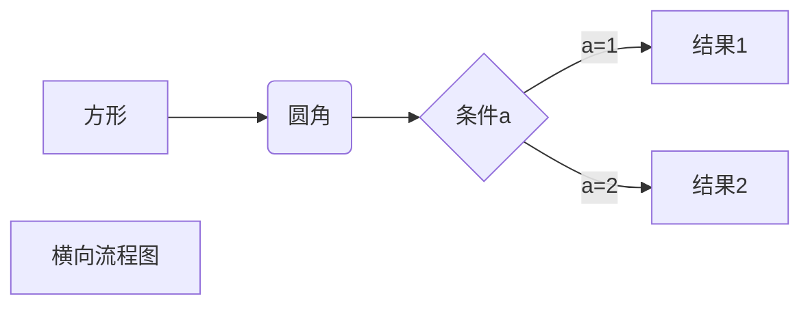
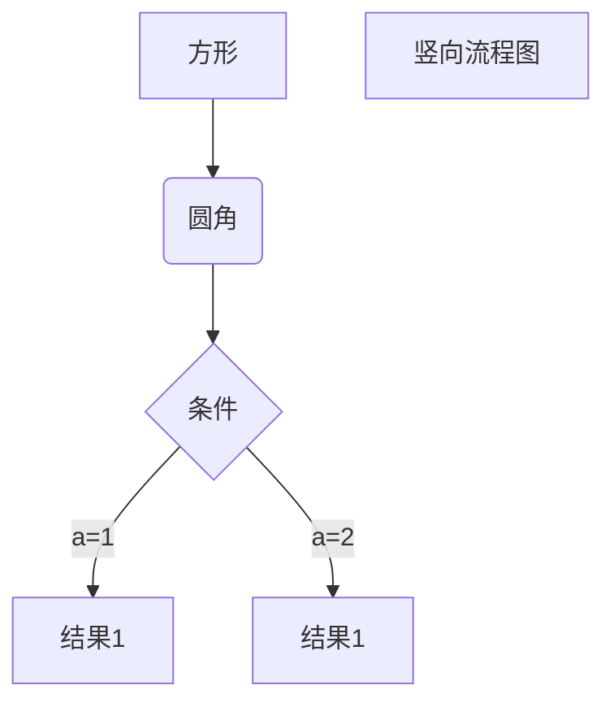
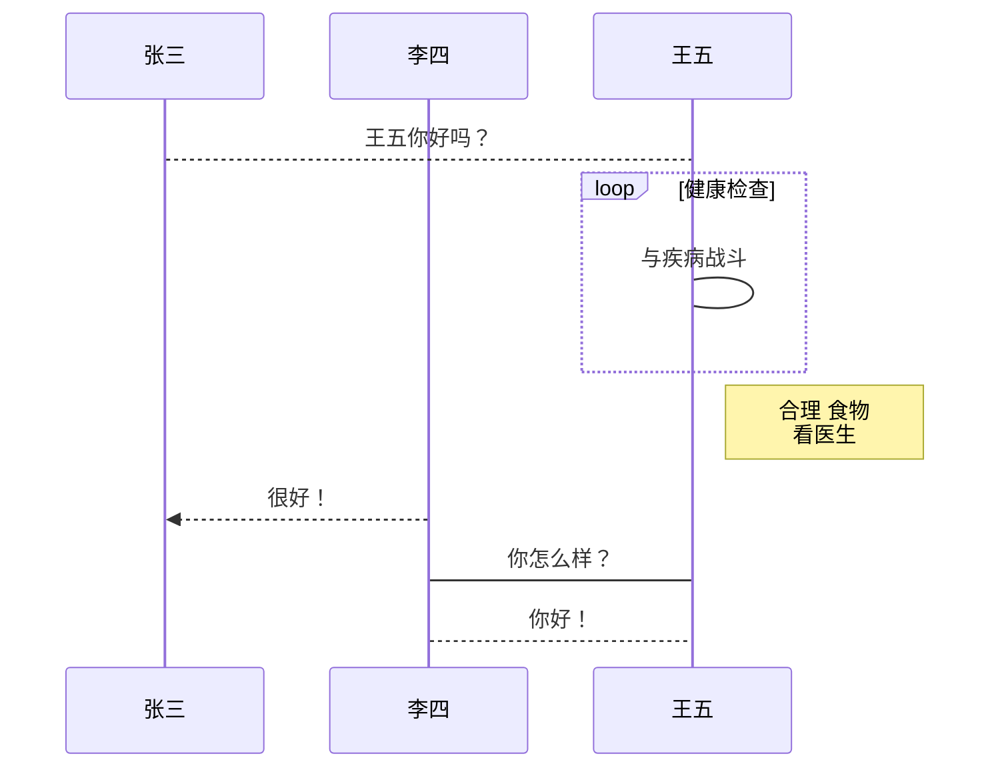
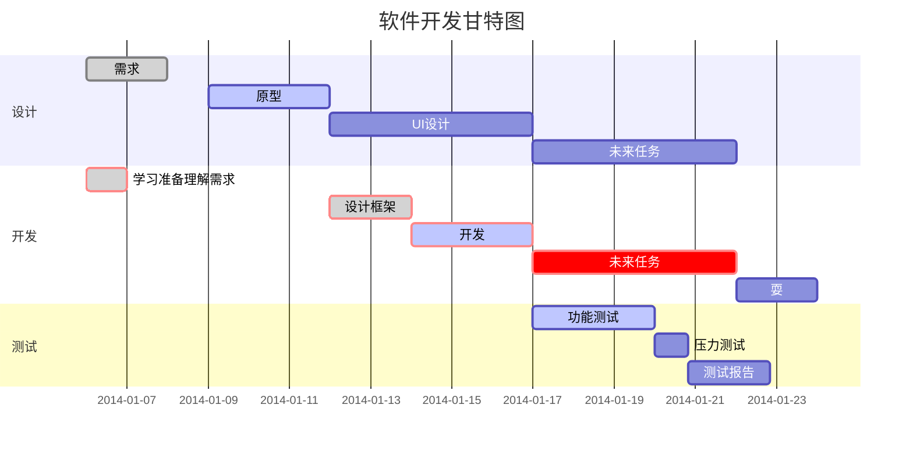
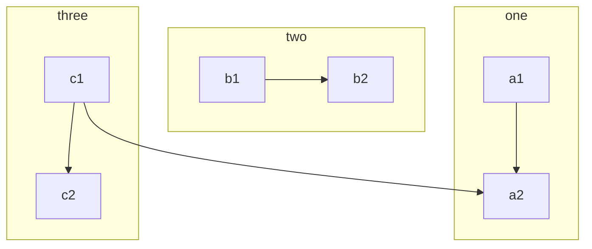

# 1 流程图

## 1.1  mermaid流程图 

> 可以画多种流程图如一般流程图，UML 时序图，甘特图
>
> ==> 粗线
>
> ---> 细线
>
> [] 方形
>
> ()圆角矩形
>
> (()) 圆形
>
> {} 菱形
>
> || 无框

1. 横向流程图

> 使用 `graph RL `开头

```
graph LR 
A[方形] -->B(圆角)
	B-->C{条件a}
	C-->|a=1| D[结果1]
	C-->|a=2| E[结果2]
	F[横向流程图]
```





2. 竖向流程图

> 使用 `graph TD`

```
graph TD
A[方形] --> B(圆角)
	B --> C{条件}
	C -->|a=1| D[结果1]
	C -->|a=2| E[结果1]
F[竖向流程图]
```





3. UML 时序图

> `%%` 表示注释
>
> `sequenceDiagram`表示时序图
>
> `> 直线，--> 虚线，->>实心箭头`

```
%% 时序图例子，-> 直线，--> 虚线，->>实心箭头
sequenceDiagram
	participant 张三
	participant 李四
	张三--> 王五: 王五你好吗？
	loop 健康检查
		王五->王五: 与疾病战斗
	end
	Note right of 王五: 合理 食物 <br/>看医生
	李四-->>张三: 很好！
	王五->李四: 你怎么样？
	李四--> 王五: 你好！
```





4. 甘特图




5. 子流程图




## 1.2 标准流程图 flow 

> start
>
> operation
>
> condition
>
> subroutine
>
> inputoutput
>
> end 
>
> 注意 冒号`:`后一定要==有空格==，否则流程图不显示

1. 竖向标准流程图

```flow
st=>start: 开始框
op=>operation: 处理框
cond=>condition: 判断框(是或否?)
sub1=>subroutine: 子流程
io=>inputoutput: 输入输出框
e=>end: 结束框

st->op->cond
cond(yes)->io->e
cond(no)->sub1(right)->op
```


2. 横向标准流程图

```flow
st=>start: 开始框
op=>operation: 处理框
cond=>condition: 判断框(是或否?)
sub1=>subroutine: 子流程
io=> inputoutput: 输入输出框
e=>end: 结束框

st(right)->op(right)->cond
cond(yes)-io(bottom)->e
cond(no)->sub1(right)->op
```


## 1.3 时序图 sequence 

> 使用 sequence 代码块
>
> A ->  B: 表示 A 用实线指向 B 
>
> B --> A:表示 B 用虚线指向 A

```sequence
对象A-->对象B: 对象B你好吗?(请求)
Note right of 对象B: 对象B的描述
Note left of 对象A: 对象A的描述(提示)
对象B-->对象A: 我很好(响应)
对象A-->对象B: 你真的好吗？ 

title: 喜剧之王
```


```sequence
title: UML 使用
对象A->对象B: 对象B你好吗？(请求)
对象B-->对象A: 我很好(响应)
对象A->对象B: 你真的好吗？
对象B->小三: 你好吗
小三-->>对象A: 对象B找我了
Note over 对象B,小三: 我们是朋友
Note left of 对象A: 对象A的描述(提示)
Note right of 对象B: 对象B的描述
participant c
Note right of c: 没人陪我玩
```


## 1.4 子流程图


## 1.5 总结

注意在流程图使用标点符号必须**英文的**。

# 2 表格 tables

> 用 `|`分割列

| 星期日 | 星期一 | 星期二 | 星期三 | 星期四 | 星期五 | 星期六 |
| :----: | :----: | :----: | ------ | ------ | ------ | ------ |
|        |        |        |        |        |        |        |
|        |        |        |        |        |        |        |
|        |        |        |        |        |        |        |
|        |        |        |        |        |        |        |
|        |        |        |        |        |        |        |


# 3 数学公式

> 输入两个 `$$` 回车，即可输入数学公式


```mathematica
x^2+\cos(\theta)
```


$$
x^2+\cos(\theta)
$$


```mathematica
\mathbf{v}1 \times \mathbf{v}2 =
\begin{vmatrix} 
\mathbf{i} & \mathbf{j}& \mathbf{k}
\\\frac{\partial X}
{\partial u} & \frac{\partial Y}
{\partial u} & 0 \\\frac{\partial X}
{\partial v} & \frac{\partial Y}
{\partial v} & 0 \\\end{vmatrix}
```


$$
\mathbf{v}1 \times \mathbf{v}2 =
\begin{vmatrix} 
\mathbf{i} & \mathbf{j}& \mathbf{k}
\\\frac{\partial X}
{\partial u} & \frac{\partial Y}
{\partial u} & 0 \\\frac{\partial X}
{\partial v} & \frac{\partial Y}
{\partial v} & 0 \\\end{vmatrix}
$$


# 4 其他	

## 4.1 地平线

> ----- 表示下面的线


## 4.2 任务列表

> “\- 空格[空格] 任务名”

- [x] 吃饭
- [x] 睡觉
- [ ] coding

## 4.3 注释

> 使用 `[^注释]`

服务器[^1]不是电脑

[^1]: 一个处理业务逻辑的应用程序


## 4.4 删除线

> 用左右两个`~~` 波浪线

~~我被删除了~~


## 4.5 目录

> 输入 `[TOC]`

[TOC]

## 4.6 表情

> `:happy;` 表示开心
>
> `:cry;` 表示哭
>
> 以及类推

:happy:

:cry:

# 5 hexo 支持typora

> 解决方法安装插件

```
npm install hexo-filter-mermaid-diagrams
```

```
npm install --save hexo-filter-sequence
```

[参考](https://tyloafer.github.io/2018/04/21/hexo-mermaid/)


